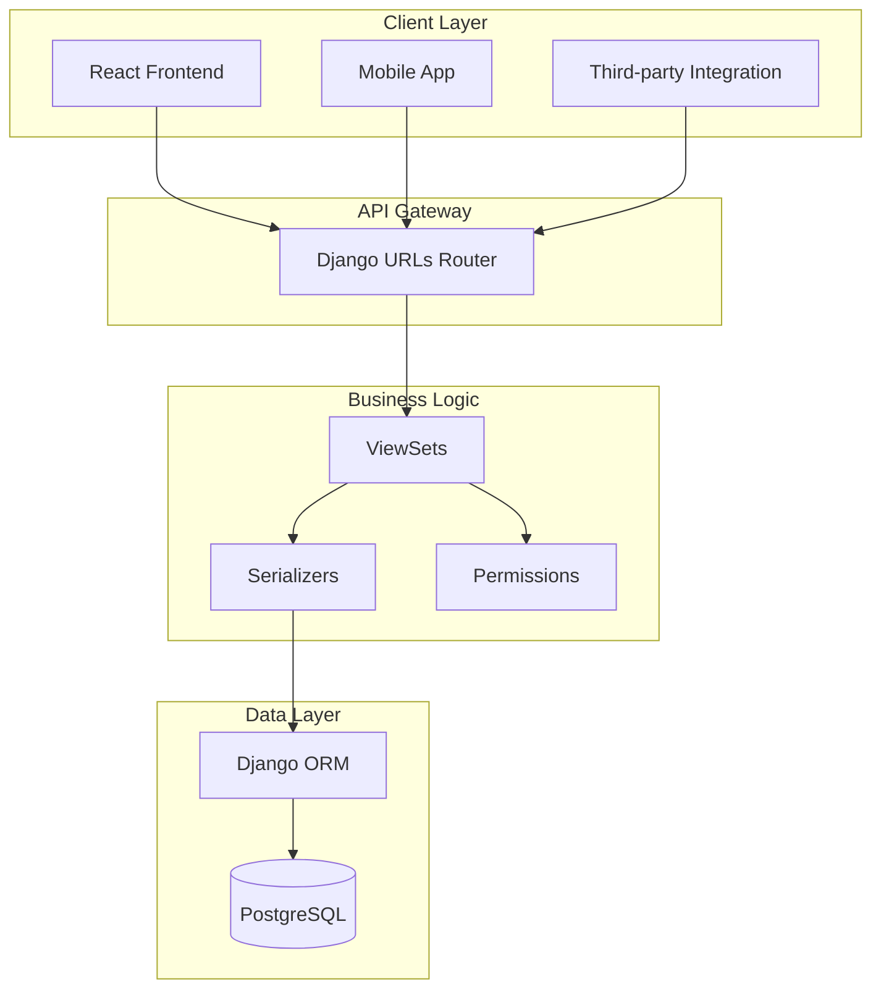

# API Documentation

## Overview

The Ticketing System API is built with Django REST Framework and provides endpoints for managing tickets, customers, columns, comments, and attachments.

**Base URL:** `http://31.97.181.167/api/`

**Authentication:** Currently set to `AllowAny` (will be changed to token-based authentication in production)

**API Documentation:**

- Swagger UI: `http://31.97.181.167/api/docs/`
- OpenAPI Schema: `http://31.97.181.167/api/schema/`

---

## API Architecture



---

## Endpoints Overview

| Resource          | Endpoint                                    | Methods                 | Description                       |
| ----------------- | ------------------------------------------- | ----------------------- | --------------------------------- |
| Tickets           | `/api/tickets/tickets/`                     | GET, POST               | List and create tickets           |
| Ticket Detail     | `/api/tickets/tickets/{id}/`                | GET, PUT, PATCH, DELETE | Retrieve, update, delete ticket   |
| Move Ticket       | `/api/tickets/tickets/{id}/move_to_column/` | POST                    | Move ticket to different column   |
| Toggle Follow     | `/api/tickets/tickets/{id}/toggle_follow/`  | POST                    | Toggle following status           |
| Columns           | `/api/tickets/columns/`                     | GET, POST               | List and create columns           |
| Column Detail     | `/api/tickets/columns/{id}/`                | GET, PUT, PATCH, DELETE | Retrieve, update, delete column   |
| Reorder Columns   | `/api/tickets/columns/reorder/`             | POST                    | Reorder columns                   |
| Customers         | `/api/tickets/customers/`                   | GET, POST               | List and create customers         |
| Customer Detail   | `/api/tickets/customers/{id}/`              | GET, PUT, PATCH, DELETE | Retrieve, update, delete customer |
| Comments          | `/api/tickets/comments/`                    | GET, POST               | List and create comments          |
| Comment Detail    | `/api/tickets/comments/{id}/`               | GET, PUT, PATCH, DELETE | Retrieve, update, delete comment  |
| Attachments       | `/api/tickets/attachments/`                 | GET, POST               | List and upload attachments       |
| Attachment Detail | `/api/tickets/attachments/{id}/`            | GET, DELETE             | Retrieve, delete attachment       |

---

## Tickets API

### List Tickets

**GET** `/api/tickets/tickets/`

Returns a paginated list of tickets.

**Query Parameters:**

- `page` (int): Page number (default: 1)
- `page_size` (int): Items per page (default: 20)
- `search` (string): Search in name and description
- `status` (string): Filter by status (new, in_progress, review, done)
- `type` (string): Filter by type (task, bug, story, epic)
- `priority_id` (int): Filter by priority (1-4)
- `column` (int): Filter by column ID
- `customer` (int): Filter by customer ID
- `ordering` (string): Order by field (e.g., `-created_at`, `priority_id`)

**Response (200 OK):**

```json
{
  "count": 42,
  "next": "http://31.97.181.167/api/tickets/tickets/?page=2",
  "previous": null,
  "results": [
    {
      "id": 1,
      "name": "Website homepage not loading",
      "type": "bug",
      "status": "in_progress",
      "priority_id": 4,
      "urgency": "high",
      "importance": "critical",
      "column": 2,
      "column_name": "In Progress",
      "customer_name": "TechCorp Solutions",
      "assignee_ids": [1, 2],
      "following": true,
      "comments_count": 3,
      "created_at": "2025-10-21T10:30:00Z",
      "updated_at": "2025-10-21T14:20:00Z"
    }
  ]
}
```

---

### Create Ticket

**POST** `/api/tickets/tickets/`

Creates a new ticket.

**Request Body:**

```json
{
  "name": "Fix login page error",
  "description": "Users are getting a 500 error when trying to log in",
  "type": "bug",
  "status": "new",
  "priority_id": 3,
  "urgency": "high",
  "importance": "high",
  "column": 1,
  "customer": 5,
  "assignee_ids": [2, 3],
  "labels": ["backend", "authentication"],
  "due_date": "2025-10-25"
}
```

**Response (201 Created):**

```json
{
  "id": 15,
  "name": "Fix login page error",
  "description": "Users are getting a 500 error when trying to log in",
  "type": "bug",
  "status": "new",
  "priority_id": 3,
  "urgency": "high",
  "importance": "high",
  "column": 1,
  "column_name": "New",
  "customer": 5,
  "customer_name": "RetailMax Inc",
  "assignees": [
    {
      "id": 2,
      "username": "john_doe",
      "email": "john@example.com",
      "first_name": "John",
      "last_name": "Doe"
    }
  ],
  "reporter": null,
  "parent": null,
  "subtasks": [],
  "following": false,
  "labels": ["backend", "authentication"],
  "due_date": "2025-10-25",
  "start_date": null,
  "comments_count": 0,
  "created_at": "2025-10-21T15:00:00Z",
  "updated_at": "2025-10-21T15:00:00Z"
}
```

---

### Get Ticket Detail

**GET** `/api/tickets/tickets/{id}/`

Returns detailed information about a specific ticket.

**Response (200 OK):**

```json
{
  "id": 1,
  "name": "Website homepage not loading",
  "description": "The homepage returns a 404 error for mobile users",
  "type": "bug",
  "status": "in_progress",
  "priority_id": 4,
  "urgency": "high",
  "importance": "critical",
  "column": 2,
  "column_name": "In Progress",
  "customer": 1,
  "customer_name": "TechCorp Solutions",
  "assignees": [
    {
      "id": 1,
      "username": "admin",
      "email": "admin@example.com",
      "first_name": "",
      "last_name": ""
    }
  ],
  "reporter": {
    "id": 1,
    "username": "admin",
    "email": "admin@example.com",
    "first_name": "",
    "last_name": ""
  },
  "parent": null,
  "subtasks": [],
  "following": true,
  "labels": ["frontend", "mobile", "urgent"],
  "due_date": "2025-10-22",
  "start_date": "2025-10-21",
  "comments_count": 3,
  "created_at": "2025-10-15T08:30:00Z",
  "updated_at": "2025-10-21T14:20:00Z"
}
```

---

### Update Ticket

**PUT/PATCH** `/api/tickets/tickets/{id}/`

Updates a ticket. Use PUT for full updates, PATCH for partial updates.

**Request Body (PATCH):**

```json
{
  "status": "review",
  "assignee_ids": [1, 2, 3]
}
```

**Response (200 OK):**

```json
{
  "id": 1,
  "name": "Website homepage not loading",
  "status": "review",
  "assignees": [...],
  ...
}
```

---

### Delete Ticket

**DELETE** `/api/tickets/tickets/{id}/`

Deletes a ticket.

**Response (204 No Content)**

---

### Move Ticket to Column

**POST** `/api/tickets/tickets/{id}/move_to_column/`

Moves a ticket to a different column.

**Request Body:**

```json
{
  "column_id": 3
}
```

**Response (200 OK):**

```json
{
  "status": "ticket moved",
  "column": "Review"
}
```

---

### Toggle Follow

**POST** `/api/tickets/tickets/{id}/toggle_follow/`

Toggles the following status of a ticket.

**Response (200 OK):**

```json
{
  "following": true
}
```

---

## Columns API

### List Columns

**GET** `/api/tickets/columns/`

Returns all kanban columns.

**Response (200 OK):**

```json
[
  {
    "id": 1,
    "name": "New",
    "order": 0,
    "color": "#0052cc",
    "tickets_count": 5,
    "created_at": "2025-10-01T00:00:00Z",
    "updated_at": "2025-10-01T00:00:00Z"
  },
  {
    "id": 2,
    "name": "In Progress",
    "order": 1,
    "color": "#ff9800",
    "tickets_count": 12,
    "created_at": "2025-10-01T00:00:00Z",
    "updated_at": "2025-10-01T00:00:00Z"
  }
]
```

---

### Create Column

**POST** `/api/tickets/columns/`

Creates a new column.

**Request Body:**

```json
{
  "name": "Testing",
  "order": 3,
  "color": "#9c27b0"
}
```

**Response (201 Created):**

```json
{
  "id": 5,
  "name": "Testing",
  "order": 3,
  "color": "#9c27b0",
  "tickets_count": 0,
  "created_at": "2025-10-21T15:00:00Z",
  "updated_at": "2025-10-21T15:00:00Z"
}
```

---

### Reorder Columns

**POST** `/api/tickets/columns/reorder/`

Reorders columns.

**Request Body:**

```json
{
  "order": [
    { "id": 1, "order": 0 },
    { "id": 3, "order": 1 },
    { "id": 2, "order": 2 },
    { "id": 4, "order": 3 }
  ]
}
```

**Response (200 OK):**

```json
{
  "status": "columns reordered"
}
```

---

## Customers API

### List Customers

**GET** `/api/tickets/customers/`

Returns a list of customers.

**Query Parameters:**

- `search` (string): Search in name, email, company
- `ordering` (string): Order by field (e.g., `name`, `-created_at`)

**Response (200 OK):**

```json
[
  {
    "id": 1,
    "name": "TechCorp Solutions",
    "email": "contact@techcorp.com",
    "phone": "+1-555-0123",
    "company": "TechCorp Solutions Inc.",
    "created_at": "2025-09-15T10:00:00Z",
    "updated_at": "2025-09-15T10:00:00Z"
  }
]
```

---

### Create Customer

**POST** `/api/tickets/customers/`

Creates a new customer.

**Request Body:**

```json
{
  "name": "StartupHub",
  "email": "hello@startuphub.com",
  "phone": "+1-555-9999",
  "company": "StartupHub LLC"
}
```

**Response (201 Created):**

```json
{
  "id": 10,
  "name": "StartupHub",
  "email": "hello@startuphub.com",
  "phone": "+1-555-9999",
  "company": "StartupHub LLC",
  "created_at": "2025-10-21T15:30:00Z",
  "updated_at": "2025-10-21T15:30:00Z"
}
```

---

## Comments API

### List Comments

**GET** `/api/tickets/comments/`

Returns comments. Typically filtered by ticket.

**Query Parameters:**

- `ticket` (int): Filter by ticket ID

**Response (200 OK):**

```json
[
  {
    "id": 1,
    "ticket": 5,
    "user": {
      "id": 2,
      "username": "john_doe",
      "email": "john@example.com",
      "first_name": "John",
      "last_name": "Doe"
    },
    "content": "I've started working on this issue.",
    "created_at": "2025-10-21T09:00:00Z",
    "updated_at": "2025-10-21T09:00:00Z"
  }
]
```

---

### Create Comment

**POST** `/api/tickets/comments/`

Creates a new comment.

**Request Body:**

```json
{
  "ticket": 5,
  "content": "The fix has been deployed to production."
}
```

**Response (201 Created):**

```json
{
  "id": 15,
  "ticket": 5,
  "user": {
    "id": 1,
    "username": "admin",
    "email": "admin@example.com",
    "first_name": "",
    "last_name": ""
  },
  "content": "The fix has been deployed to production.",
  "created_at": "2025-10-21T16:00:00Z",
  "updated_at": "2025-10-21T16:00:00Z"
}
```

---

## Attachments API

### Upload Attachment

**POST** `/api/tickets/attachments/`

Uploads a file attachment to a ticket.

**Request (multipart/form-data):**

- `ticket` (int): Ticket ID
- `file` (file): File to upload
- `filename` (string): Original filename

**Response (201 Created):**

```json
{
  "id": 3,
  "ticket": 5,
  "file": "http://31.97.181.167/media/attachments/2025/10/21/screenshot.png",
  "filename": "screenshot.png",
  "uploaded_by": {
    "id": 1,
    "username": "admin",
    "email": "admin@example.com",
    "first_name": "",
    "last_name": ""
  },
  "uploaded_at": "2025-10-21T16:15:00Z"
}
```

---

## Error Responses

### 400 Bad Request

```json
{
  "name": ["This field is required."],
  "column": ["Invalid pk \"999\" - object does not exist."]
}
```

### 404 Not Found

```json
{
  "detail": "Not found."
}
```

### 500 Internal Server Error

```json
{
  "detail": "Internal server error."
}
```

---

## Pagination

All list endpoints support pagination with the following response format:

```json
{
  "count": 100,
  "next": "http://31.97.181.167/api/tickets/tickets/?page=3",
  "previous": "http://31.97.181.167/api/tickets/tickets/?page=1",
  "results": [...]
}
```

**Query Parameters:**

- `page`: Page number
- `page_size`: Items per page (max 100)

---

## Filtering & Search

### Search

Use the `search` parameter to search across multiple fields:

```
GET /api/tickets/tickets/?search=homepage
```

### Filtering

Use field names as query parameters:

```
GET /api/tickets/tickets/?status=in_progress&priority_id=4
```

### Ordering

Use the `ordering` parameter:

```
GET /api/tickets/tickets/?ordering=-created_at
GET /api/tickets/tickets/?ordering=priority_id,-updated_at
```

---

## Example Usage

### JavaScript (Fetch API)

```javascript
// Get all tickets
fetch("http://31.97.181.167/api/tickets/tickets/")
  .then((response) => response.json())
  .then((data) => console.log(data));

// Create a ticket
fetch("http://31.97.181.167/api/tickets/tickets/", {
  method: "POST",
  headers: {
    "Content-Type": "application/json",
  },
  body: JSON.stringify({
    name: "New ticket",
    type: "task",
    column: 1,
    priority_id: 2,
  }),
})
  .then((response) => response.json())
  .then((data) => console.log(data));
```

### Python (requests)

```python
import requests

# Get all tickets
response = requests.get('http://31.97.181.167/api/tickets/tickets/')
tickets = response.json()

# Create a ticket
data = {
    'name': 'New ticket',
    'type': 'task',
    'column': 1,
    'priority_id': 2
}
response = requests.post('http://31.97.181.167/api/tickets/tickets/', json=data)
new_ticket = response.json()
```

### cURL

```bash
# Get all tickets
curl http://31.97.181.167/api/tickets/tickets/

# Create a ticket
curl -X POST http://31.97.181.167/api/tickets/tickets/ \
  -H "Content-Type: application/json" \
  -d '{"name":"New ticket","type":"task","column":1,"priority_id":2}'
```

---

## Tags API

### List Tags

**GET** `/api/tickets/tags/`

Returns a list of all tags (project-specific organizational units).

**Query Parameters:**

- `project` (int): Filter by project/column ID
- `search` (string): Search in tag name and description
- `ordering` (string): Order by field (e.g., `name`, `-created_at`)

**Response (200 OK):**

```json
{
  "count": 5,
  "results": [
    {
      "id": 1,
      "name": "Nikora",
      "description": "Nikora supermarket chain tickets",
      "color": "#0052cc",
      "project_name": "Main Project",
      "tickets_count": 12,
      "contacts_count": 2
    }
  ]
}
```

### Get Tag Details

**GET** `/api/tickets/tags/{id}/`

Returns detailed information about a tag, including associated contacts.

**Response (200 OK):**

```json
{
  "id": 1,
  "name": "Nikora",
  "description": "Nikora supermarket chain tickets",
  "color": "#0052cc",
  "project": 1,
  "project_name": "Main Project",
  "contacts": [
    {
      "id": 1,
      "tag": 1,
      "contact": {
        "id": 1,
        "name": "Giorgi Beridze",
        "email": "g.beridze@nikora.ge",
        "phone": "+995 555 123 456",
        "title": "IT Manager",
        "department": "IT Department",
        "description": "Primary technical contact"
      },
      "role": "Primary Contact",
      "added_at": "2024-01-15T10:30:00Z",
      "added_by": {
        "id": 1,
        "username": "admin",
        "email": "admin@example.com"
      }
    }
  ],
  "tickets_count": 12,
  "created_by": {
    "id": 1,
    "username": "admin",
    "email": "admin@example.com"
  },
  "created_at": "2024-01-01T00:00:00Z",
  "updated_at": "2024-01-15T10:30:00Z"
}
```

### Create Tag

**POST** `/api/tickets/tags/`

Creates a new tag. **Only superadmins can create tags.**

**Request Body:**

```json
{
  "name": "Nokia",
  "description": "Nokia telecommunications tickets",
  "color": "#0052cc",
  "project": 1
}
```

**Response (201 Created):**

```json
{
  "id": 2,
  "name": "Nokia",
  "description": "Nokia telecommunications tickets",
  "color": "#0052cc",
  "project": 1,
  "project_name": "Main Project",
  "contacts": [],
  "tickets_count": 0,
  "created_by": {
    "id": 1,
    "username": "admin"
  },
  "created_at": "2024-01-16T09:00:00Z"
}
```

### Update Tag

**PUT/PATCH** `/api/tickets/tags/{id}/`

Updates tag information. **Only superadmins can edit tags.**

### Delete Tag

**DELETE** `/api/tickets/tags/{id}/`

Deletes a tag. **Only superadmins can delete tags.**

**Response (204 No Content)**

### Get Tag Contacts

**GET** `/api/tickets/tags/{id}/contacts/`

Returns all contacts associated with a specific tag.

**Response (200 OK):**

```json
[
  {
    "id": 1,
    "tag": 1,
    "contact": {
      "id": 1,
      "name": "Giorgi Beridze",
      "email": "g.beridze@nikora.ge",
      "phone": "+995 555 123 456",
      "title": "IT Manager",
      "department": "IT Department"
    },
    "role": "Primary Contact",
    "added_at": "2024-01-15T10:30:00Z"
  }
]
```

### Add Contact to Tag

**POST** `/api/tickets/tags/{id}/add_contact/`

Associates a contact with a tag.

**Request Body:**

```json
{
  "contact_id": 1,
  "role": "Primary Contact"
}
```

**Response (201 Created):**

```json
{
  "id": 1,
  "tag": 1,
  "contact": {
    "id": 1,
    "name": "Giorgi Beridze",
    "email": "g.beridze@nikora.ge"
  },
  "role": "Primary Contact",
  "added_at": "2024-01-15T10:30:00Z"
}
```

### Remove Contact from Tag

**DELETE** `/api/tickets/tags/{id}/remove_contact/`

Removes a contact from a tag.

**Request Body:**

```json
{
  "contact_id": 1
}
```

**Response (204 No Content)**

### Get Tag Tickets

**GET** `/api/tickets/tags/{id}/tickets/`

Returns all tickets associated with a specific tag.

---

## Contacts API

### List Contacts

**GET** `/api/tickets/contacts/`

Returns a list of all contacts.

**Query Parameters:**

- `search` (string): Search in name, email, title, department, description
- `ordering` (string): Order by field (e.g., `name`, `-created_at`)

**Response (200 OK):**

```json
{
  "count": 3,
  "results": [
    {
      "id": 1,
      "name": "Giorgi Beridze",
      "email": "g.beridze@nikora.ge",
      "phone": "+995 555 123 456",
      "title": "IT Manager",
      "department": "IT Department",
      "description": "Primary technical contact for Nikora",
      "created_at": "2024-01-01T00:00:00Z",
      "updated_at": "2024-01-15T10:30:00Z"
    }
  ]
}
```

### Get Contact Details

**GET** `/api/tickets/contacts/{id}/`

Returns detailed information about a contact.

### Create Contact

**POST** `/api/tickets/contacts/`

Creates a new contact.

**Request Body:**

```json
{
  "name": "Levan Meskhi",
  "email": "l.meskhi@nokia.com",
  "phone": "+995 555 345 678",
  "title": "Technical Lead",
  "department": "Engineering",
  "description": "Nokia technical escalation contact"
}
```

**Response (201 Created):**

```json
{
  "id": 3,
  "name": "Levan Meskhi",
  "email": "l.meskhi@nokia.com",
  "phone": "+995 555 345 678",
  "title": "Technical Lead",
  "department": "Engineering",
  "description": "Nokia technical escalation contact",
  "created_at": "2024-01-16T09:30:00Z",
  "updated_at": "2024-01-16T09:30:00Z"
}
```

### Update Contact

**PUT/PATCH** `/api/tickets/contacts/{id}/`

Updates contact information.

### Delete Contact

**DELETE** `/api/tickets/contacts/{id}/`

Deletes a contact.

**Response (204 No Content)**

### Get Contact Tags

**GET** `/api/tickets/contacts/{id}/tags/`

Returns all tags associated with a specific contact.

---

## Ticket Tags API

### List Ticket Tags

**GET** `/api/tickets/ticket-tags/`

Returns ticket-tag associations.

**Query Parameters:**

- `ticket` (int): Filter by ticket ID
- `tag` (int): Filter by tag ID

### Add Tag to Ticket

**POST** `/api/tickets/ticket-tags/`

Associates a tag with a ticket.

**Request Body:**

```json
{
  "ticket": 1,
  "tag_id": 1
}
```

**Response (201 Created):**

```json
{
  "id": 1,
  "ticket": 1,
  "tag": {
    "id": 1,
    "name": "Nikora",
    "description": "Nikora supermarket chain tickets",
    "color": "#0052cc",
    "project_name": "Main Project",
    "tickets_count": 13,
    "contacts_count": 2
  },
  "added_at": "2024-01-16T10:00:00Z",
  "added_by": {
    "id": 1,
    "username": "admin"
  }
}
```

### Remove Tag from Ticket

**DELETE** `/api/tickets/ticket-tags/{id}/`

Removes a tag from a ticket.

**Response (204 No Content)**

---

## User Tags API (Team Membership)

### List User Tags

**GET** `/api/tickets/user-tags/`

Returns user-tag associations (team membership).

**Query Parameters:**

- `user` (int): Filter by user ID
- `tag` (int): Filter by tag ID

### Add User to Tag (Team)

**POST** `/api/tickets/user-tags/`

Adds a user to a tag-based team.

**Request Body:**

```json
{
  "user_id": 2,
  "tag_id": 4
}
```

### Remove User from Tag (Team)

**DELETE** `/api/tickets/user-tags/{id}/`

Removes a user from a tag-based team.

---

## Filtering Examples

### Get tickets by tag

```bash
GET /api/tickets/tickets/?tags=1
```

### Get tickets with multiple tags

```bash
GET /api/tickets/tickets/?tags=1&tags=2
```

### Get tags for a specific project

```bash
GET /api/tickets/tags/?project=1
```

### Search contacts

```bash
GET /api/tickets/contacts/?search=nokia
```

---

## API Response Format

All API responses follow a consistent format:

### Success Response

```json
{
  "id": 1,
  "field1": "value1",
  "field2": "value2"
}
```

### List Response (Paginated)

```json
{
  "count": 42,
  "next": "http://31.97.181.167/api/tickets/tickets/?page=2",
  "previous": null,
  "results": [
    {
      "id": 1,
      "field1": "value1"
    }
  ]
}
```

### Error Response

```json
{
  "error": "Error message",
  "detail": "Detailed error information"
}
```
