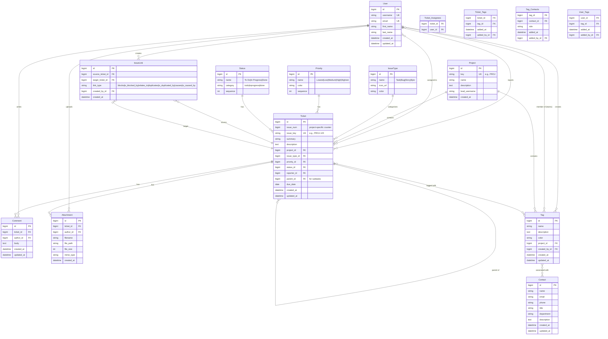
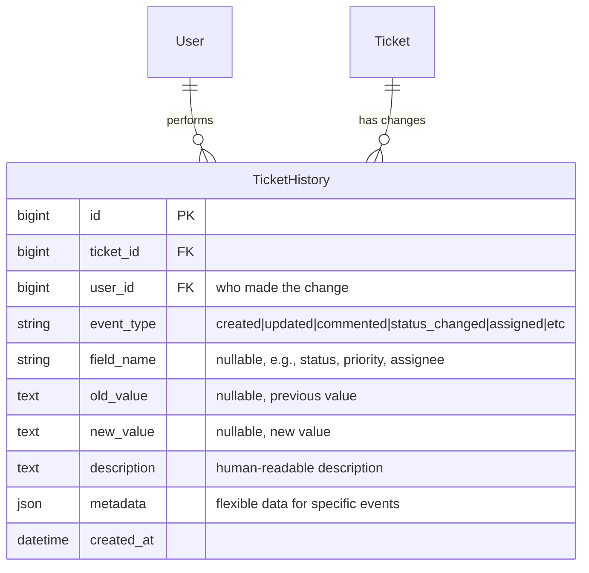

# Database Schema Documentation

## Overview

This document describes the simplified database schema for the Ticketing System, inspired by Jira's architecture but focused exclusively on ticket management. The system uses PostgreSQL as the database backend and is built with Django ORM.

## Design Philosophy

Based on Jira's proven schema, we've created a **minimal viable structure** that captures the essence of ticket tracking without the complexity of project management, workflows, screens, and permissions that Jira requires. Our schema focuses on:

- **Core ticket data** (summary, description, type, priority, status)
- **User assignments** (reporter, assignees)
- **Organization** (projects as "columns", issue types)
- **Collaboration** (comments, attachments)
- **Hierarchical relationships** (parent-child for subtasks)

## Simplified Entity Relationship Diagram



## Core Tables

### User

Simplified user table (Django's built-in model).

**Key Fields from Jira:**

- `id`: Primary key
- `username`: Unique login name
- `email`: Email address
- `first_name`, `last_name`: Display name components

**Jira Equivalent:** `cwd_user` (Jira uses Crowd for user management)

---

### Project

Replaces Jira's complex project table with essentials only.

**Fields:**

- `id` (PK): Auto-incrementing ID
- `key` (Unique): Short code (e.g., "PROJ", "BUG")
- `name`: Project display name
- `description`: Project description
- `lead_username`: Project lead
- `created_at`: Creation timestamp

**Jira Equivalent:** `project` table

- We've removed: project category, avatar, assignee type, workflow schemes, permission schemes

---

### IssueType

Defines ticket categories (Task, Bug, Story, Epic).

**Fields:**

- `id` (PK): Auto-incrementing ID
- `name`: Type name (Task, Bug, Story, Epic)
- `icon_url`: Icon path/URL
- `color`: Hex color for UI display

**Jira Equivalent:** `issuetype` table

- Simplified from Jira's complex type/subtype hierarchy

---

### Priority

Priority levels for tickets.

**Fields:**

- `id` (PK): Auto-incrementing ID
- `name`: Priority name (Lowest, Low, Medium, High, Highest)
- `color`: Hex color for UI
- `sequence`: Display order

**Jira Equivalent:** `priority` table (nearly identical)

---

### Status

Current state of a ticket.

**Fields:**

- `id` (PK): Auto-incrementing ID
- `name`: Status name (To Do, In Progress, Done)
- `category`: Status category (todo, inprogress, done)
- `sequence`: Display order in workflow

**Jira Equivalent:** `issuestatus` table

- Removed: complex workflow associations, transitions

---

### Ticket (Core Entity)

Main ticket/issue table - simplified from Jira's `jiraissue`.

**Fields:**

- `id` (PK): Global unique ID
- `issue_num`: Project-scoped counter (1, 2, 3...)
- `issue_key` (Unique): Human-readable key (e.g., "PROJ-123")
- `summary`: Ticket title/summary
- `description`: Detailed description (supports markdown)
- `project_id` (FK): Project association
- `issue_type_id` (FK): Issue type (Task, Bug, etc.)
- `priority_id` (FK): Priority level
- `status_id` (FK): Current status
- `reporter_id` (FK): User who created the ticket
- `parent_id` (FK): Parent ticket (for subtasks)
- `due_date`: Target completion date
- `created_at`: Creation timestamp
- `updated_at`: Last modification timestamp

**Jira Equivalent:** `jiraissue` table

- **Removed from Jira's schema:**
  - `workflow_id`, `security_level`, `environment`
  - `time_estimate`, `time_spent`, `original_estimate`
  - `votes`, `watches`
  - Resolution fields
  - Version fields (affects/fix versions)
  - Components

**Issue Key Generation:**
The `issue_key` follows Jira's pattern: `{PROJECT_KEY}-{ISSUE_NUM}`

- Example: "BUG-1", "PROJ-42", "TASK-123"

---

### Ticket_Assignees (Many-to-Many)

Links tickets to assigned users.

**Fields:**

- `ticket_id` (FK): Reference to Ticket
- `user_id` (FK): Reference to User

**Jira Difference:**

- Jira uses a single `assignee` field in `jiraissue`
- We support multiple assignees (common in modern systems)

---

### Comment

User comments on tickets.

**Fields:**

- `id` (PK): Comment ID
- `ticket_id` (FK): Associated ticket
- `author_id` (FK): Comment author
- `body`: Comment text (markdown supported)
- `created_at`: Creation timestamp
- `updated_at`: Edit timestamp

**Jira Equivalent:** `jiraaction` table (with action type = comment)

- Simplified: removed action groups, levels, roles

---

### Attachment

File attachments on tickets.

**Fields:**

- `id` (PK): Attachment ID
- `ticket_id` (FK): Associated ticket
- `author_id` (FK): Uploader
- `filename`: Original filename
- `file_path`: Storage path
- `file_size`: Size in bytes
- `mime_type`: File type
- `created_at`: Upload timestamp

**Jira Equivalent:** `fileattachment` table (nearly identical)

---

### Tag

Project-specific tags for organizing tickets by clients, locations, teams, etc.

**Fields:**

- `id` (PK): Tag ID
- `name`: Tag name (e.g., "Nikora", "Nokia", "Finances Team")
- `description`: Optional description text
- `color`: Hex color code for UI display (all tags use same color for simplicity)
- `project_id` (FK): Project this tag belongs to
- `created_by_id` (FK): User who created the tag (must be superadmin)
- `created_at`: Creation timestamp
- `updated_at`: Last modification timestamp

**Design Notes:**

- Tags are **project-specific** (not global)
- Only **superadmins** can create, edit, or delete tags
- All tags share the **same color** (no per-tag customization)
- No hierarchy or types (flat structure)
- Tags can represent: clients (Nikora, Nokia), locations (Batumi), teams (Finances), or any other organizational unit

**Jira Equivalent:** `label` table (but simpler)

- Removed: global labels, per-user label visibility
- Added: project scope, contact associations, admin-only management

---

### Contact

Contact information for people associated with tags (clients, stakeholders, etc.).

**Fields:**

- `id` (PK): Contact ID
- `name`: Full name
- `email`: Email address
- `phone`: Phone number (optional)
- `title`: Job title (optional)
- `department`: Department/Division (optional)
- `description`: Additional notes about this contact
- `created_at`: Creation timestamp
- `updated_at`: Last modification timestamp

**Design Notes:**

- One contact can be associated with **multiple tags**
- Contacts store basic information: name, email, phone, title, department, description
- No automatic notifications (for now)
- Contacts are **not users** in the system (separate from User table)

---

### Ticket_Tags (Many-to-Many)

Links tickets to tags.

**Fields:**

- `ticket_id` (FK): Reference to Ticket
- `tag_id` (FK): Reference to Tag
- `added_at`: When tag was added to ticket
- `added_by_id` (FK): User who added the tag

**Design Notes:**

- A ticket can have multiple tags
- Tracks who added each tag and when

---

### Tag_Contacts (Many-to-Many)

Links tags to their associated contacts.

**Fields:**

- `tag_id` (FK): Reference to Tag
- `contact_id` (FK): Reference to Contact
- `role`: Optional role description (e.g., "Primary Contact", "Technical Lead")
- `added_at`: When contact was linked to tag
- `added_by_id` (FK): User who created the link

**Design Notes:**

- A tag can have multiple contacts
- A contact can be associated with multiple tags
- Optional role field for context (e.g., "Primary", "Technical", "Billing")

---

### User_Tags (Many-to-Many)

Links users to tags (for team membership).

**Fields:**

- `user_id` (FK): Reference to User
- `tag_id` (FK): Reference to Tag
- `added_at`: When user was added to tag
- `added_by_id` (FK): User who created the link

**Design Notes:**

- Users can be members of tag-based teams (e.g., "Finances Team")
- A user can belong to multiple tags
- No special permissions from tag membership (just organizational)

---

### IssueLink

Links between tickets representing relationships like "blocks", "relates to", "duplicates".

**Fields:**

- `id` (PK): Link ID
- `source_ticket_id` (FK): Ticket creating the relationship
- `target_ticket_id` (FK): Ticket being referenced
- `link_type`: Type of relationship
  - `blocks`: Source blocks target (e.g., "TICK-1 blocks TICK-2")
  - `is_blocked_by`: Inverse of blocks
  - `relates_to`: General relationship
  - `duplicates`: Source duplicates target
  - `is_duplicated_by`: Inverse of duplicates
  - `causes`: Source causes target
  - `is_caused_by`: Inverse of causes
- `created_by_id` (FK): User who created the link
- `created_at`: When link was created

**Design Notes:**

- One ticket can have multiple links to other tickets
- Links are directional (source → target)
- Inverse relationships can be auto-created (e.g., when A blocks B, also create B is_blocked_by A)
- Links can cross projects (TICK-1 can block PROJ-5)
- Prevents circular relationships in validation

**Jira Equivalent:** `issuelink` table

- Jira uses `issuelinktype` table to define custom link types
- We use predefined link types for simplicity
- Can be extended to support custom link types later

---

## What We Removed from Jira

To keep the schema simple and focused on tickets, we removed:

### Workflow & Transitions

- `workflowscheme`, `workflowschemeissue`, `osjiraworkflow`
- Tickets can change status freely (no enforced transitions)

### Permissions & Security

- `permissionscheme`, `schemepermissions`, `schemeissuegroups`
- `issuesecurityscheme`, `issuesecuritylevel`
- Using Django's built-in auth system instead

### Screens & Fields

- `fieldscreen`, `fieldscreentab`, `fieldscreenscheme`
- `customfield`, `customfieldvalue`
- Fixed field set for simplicity

### Components & Versions

- `component`, `nodeassociation` (components)
- `projectversion` (affects/fix versions)
- Can be added as JSON labels if needed

### Time Tracking

- `worklog`, `timeoriginalestimate`, `timespent`
- Removed work logging complexity

### Advanced Features

- ~~`issuelink`, `issuelinktype` (link types like "blocks", "relates to")~~ **← We added this with predefined link types!**
- `label` table (using JSON array instead)
- `resolution` table
- ~~`changehistory`, `changeitem` (audit log)~~ **← We'll add a simplified version!**
- Email notifications, watches, votes

---

## Ticket History & Audit Trail

### How Jira Handles History

Jira uses a comprehensive change tracking system with two main tables:

1. **`changegroup`** - Groups changes together

   - `id`: Unique ID
   - `issueid`: Which ticket was changed
   - `author`: Who made the change
   - `created`: When the change happened

2. **`changeitem`** - Individual field changes
   - `id`: Unique ID
   - `groupid`: Links to changegroup
   - `fieldtype`: Type of field (jira, custom, etc.)
   - `field`: Field name (e.g., "status", "assignee", "priority")
   - `oldvalue`: Previous value
   - `oldstring`: Previous display text
   - `newvalue`: New value
   - `newstring`: New display text

**Example in Jira:**
When you change a ticket's status from "To Do" to "In Progress" and assign it to John:

- Creates 1 `changegroup` record (transaction)
- Creates 2 `changeitem` records:
  - Item 1: status changed (oldvalue: 1, oldstring: "To Do", newvalue: 2, newstring: "In Progress")
  - Item 2: assignee changed (oldvalue: null, oldstring: null, newvalue: 123, newstring: "John Doe")

### Our Simplified Approach

We'll implement a **single-table history system** that's simpler but still captures all important changes.



### TicketHistory Table

**Fields:**

- `id` (PK): History entry ID
- `ticket_id` (FK): Which ticket changed
- `user_id` (FK): Who made the change (nullable for system events)
- `event_type`: Type of event (see Event Types below)
- `field_name`: Which field changed (nullable for events like "commented")
- `old_value`: Previous value (nullable)
- `new_value`: New value (nullable)
- `description`: Human-readable description (auto-generated)
- `metadata`: JSON field for event-specific data
- `created_at`: When the change happened

**Event Types:**

- `created` - Ticket was created
- `updated` - General update (deprecated, use specific types)
- `field_changed` - Any field value changed
- `status_changed` - Status transition
- `priority_changed` - Priority changed
- `assigned` - User assigned to ticket
- `unassigned` - User removed from ticket
- `commented` - Comment added
- `comment_edited` - Comment modified
- `comment_deleted` - Comment deleted
- `attachment_added` - File attached
- `attachment_deleted` - File removed
- `parent_changed` - Parent ticket changed
- `due_date_set` - Due date added/changed
- `due_date_cleared` - Due date removed
- `description_changed` - Description edited

**Why This Design?**

✅ **Simpler**: One table instead of two
✅ **Flexible**: JSON metadata for event-specific data
✅ **Queryable**: Easy to filter by ticket, user, event type, or date
✅ **Human-readable**: Description field for UI display
✅ **Complete**: Captures all ticket lifecycle events

### Example History Records

```sql
-- Ticket created
INSERT INTO ticket_history (ticket_id, user_id, event_type, description, metadata) VALUES
(1, 1, 'created', 'John Doe created BUG-1', '{"issue_key": "BUG-1"}');

-- Status changed
INSERT INTO ticket_history (ticket_id, user_id, event_type, field_name, old_value, new_value, description) VALUES
(1, 1, 'status_changed', 'status', '1', '2', 'John Doe changed status from To Do to In Progress');

-- Priority changed
INSERT INTO ticket_history (ticket_id, user_id, event_type, field_name, old_value, new_value, description) VALUES
(1, 1, 'priority_changed', 'priority', '2', '4', 'John Doe changed priority from Low to High');

-- User assigned
INSERT INTO ticket_history (ticket_id, user_id, event_type, field_name, new_value, description, metadata) VALUES
(1, 1, 'assigned', 'assignees', '5', 'John Doe assigned Jane Smith', '{"assignee_id": 5, "assignee_name": "Jane Smith"}');

-- Comment added
INSERT INTO ticket_history (ticket_id, user_id, event_type, description, metadata) VALUES
(1, 2, 'commented', 'Jane Smith added a comment', '{"comment_id": 15, "comment_preview": "I will start working on this..."}');

-- Attachment added
INSERT INTO ticket_history (ticket_id, user_id, event_type, description, metadata) VALUES
(1, 2, 'attachment_added', 'Jane Smith attached screenshot.png', '{"attachment_id": 3, "filename": "screenshot.png", "file_size": 245678}');

-- Due date set
INSERT INTO ticket_history (ticket_id, user_id, event_type, field_name, new_value, description) VALUES
(1, 1, 'due_date_set', 'due_date', '2025-10-25', 'John Doe set due date to Oct 25, 2025');
```

### Auto-generating History

In Django, use signals to automatically track changes:

```python
# tickets/signals.py
from django.db.models.signals import post_save, pre_save, m2m_changed
from django.dispatch import receiver
from .models import Ticket, Comment, Attachment, TicketHistory

@receiver(pre_save, sender=Ticket)
def track_ticket_changes(sender, instance, **kwargs):
    if instance.pk:  # Existing ticket
        old_ticket = Ticket.objects.get(pk=instance.pk)

        # Track status changes
        if old_ticket.status_id != instance.status_id:
            TicketHistory.objects.create(
                ticket=instance,
                user=instance.updated_by,  # Need to pass this
                event_type='status_changed',
                field_name='status',
                old_value=str(old_ticket.status_id),
                new_value=str(instance.status_id),
                description=f"Status changed from {old_ticket.status.name} to {instance.status.name}"
            )

        # Track priority changes
        if old_ticket.priority_id != instance.priority_id:
            TicketHistory.objects.create(
                ticket=instance,
                user=instance.updated_by,
                event_type='priority_changed',
                field_name='priority',
                old_value=str(old_ticket.priority_id),
                new_value=str(instance.priority_id),
                description=f"Priority changed from {old_ticket.priority.name} to {instance.priority.name}"
            )

@receiver(post_save, sender=Ticket, created=True)
def track_ticket_creation(sender, instance, created, **kwargs):
    if created:
        TicketHistory.objects.create(
            ticket=instance,
            user=instance.reporter,
            event_type='created',
            description=f"{instance.reporter.username} created {instance.issue_key}",
            metadata={'issue_key': instance.issue_key}
        )

@receiver(post_save, sender=Comment)
def track_comment(sender, instance, created, **kwargs):
    if created:
        TicketHistory.objects.create(
            ticket=instance.ticket,
            user=instance.author,
            event_type='commented',
            description=f"{instance.author.username} added a comment",
            metadata={
                'comment_id': instance.id,
                'comment_preview': instance.body[:100]
            }
        )
```

### Displaying History in UI

**Timeline View (like Jira's Activity tab):**

```
[Icon] John Doe created BUG-1                          Oct 20, 2025 10:30 AM
[Icon] John Doe changed status from To Do to In Progress   Oct 20, 2025 2:15 PM
       changed priority from Low to High
[Icon] Jane Smith added a comment                      Oct 21, 2025 9:00 AM
       "I will start working on this today"
[Icon] Jane Smith attached screenshot.png              Oct 21, 2025 9:15 AM
[Icon] John Doe set due date to Oct 25, 2025          Oct 21, 2025 10:00 AM
```

### API Endpoint for History

```python
# tickets/views.py
from rest_framework.decorators import action

class TicketViewSet(viewsets.ModelViewSet):
    # ... existing code ...

    @action(detail=True, methods=['get'])
    def history(self, request, pk=None):
        """Get complete history of a ticket"""
        ticket = self.get_object()
        history = TicketHistory.objects.filter(ticket=ticket).order_by('-created_at')
        serializer = TicketHistorySerializer(history, many=True)
        return Response(serializer.data)
```

**Response:**

```json
[
  {
    "id": 123,
    "ticket_id": 1,
    "user": {
      "id": 1,
      "username": "john_doe",
      "first_name": "John",
      "last_name": "Doe"
    },
    "event_type": "status_changed",
    "field_name": "status",
    "old_value": "1",
    "new_value": "2",
    "description": "John Doe changed status from To Do to In Progress",
    "metadata": null,
    "created_at": "2025-10-20T14:15:00Z"
  },
  {
    "id": 122,
    "ticket_id": 1,
    "user": {
      "id": 1,
      "username": "john_doe",
      "first_name": "John",
      "last_name": "Doe"
    },
    "event_type": "created",
    "field_name": null,
    "old_value": null,
    "new_value": null,
    "description": "john_doe created BUG-1",
    "metadata": { "issue_key": "BUG-1" },
    "created_at": "2025-10-20T10:30:00Z"
  }
]
```

### Performance Considerations

**Indexes:**

```sql
CREATE INDEX idx_history_ticket ON ticket_history(ticket_id, created_at DESC);
CREATE INDEX idx_history_user ON ticket_history(user_id);
CREATE INDEX idx_history_event ON ticket_history(event_type);
CREATE INDEX idx_history_created ON ticket_history(created_at DESC);
```

**Retention Policy:**
History records should be kept indefinitely for audit purposes, but you can:

- Archive history older than 2 years to separate table
- Use PostgreSQL partitioning by date
- Implement soft deletes (keep records even if ticket deleted)

### Comparison: Jira vs Our System

| Aspect             | Jira                               | Our System                           |
| ------------------ | ---------------------------------- | ------------------------------------ |
| **Tables**         | 2 (changegroup + changeitem)       | 1 (ticket_history)                   |
| **Complexity**     | High (group-based transactions)    | Low (flat structure)                 |
| **Grouping**       | Groups changes in same transaction | Individual events                    |
| **Field Tracking** | Stores both ID and display text    | Stores ID, generates display on read |
| **Flexibility**    | Fixed schema                       | JSON metadata for extras             |
| **Query Speed**    | Slower (joins required)            | Faster (single table)                |
| **Storage**        | More normalized, less duplication  | Denormalized, includes description   |
| **Use Case**       | Enterprise audit requirements      | Agile team collaboration             |

### When to Use Jira's Approach

Consider Jira's two-table system if you need:

- ✅ Strict audit compliance (SOX, HIPAA, etc.)
- ✅ Atomic transaction grouping (all-or-nothing)
- ✅ Complex rollback scenarios
- ✅ High-volume enterprise scale (millions of tickets)

### Why Our Approach is Better for Most Cases

Our single-table system wins for:

- ✅ Simpler queries (no joins)
- ✅ Easier to understand and maintain
- ✅ Faster reads (single table scan)
- ✅ Flexible metadata (JSON for edge cases)
- ✅ Human-readable descriptions (better UX)
- ✅ Adequate for most ticketing systems

---

## Key Design Decisions

### 1. Issue Key Format

Following Jira's proven `PROJECT-NUMBER` format:

```
BUG-1, BUG-2, BUG-3
PROJ-1, PROJ-2, PROJ-3
```

### 2. Reference Tables

Using FK references instead of string enums for:

- Issue types (allows custom types)
- Priorities (configurable levels)
- Statuses (flexible workflow)
- Projects (organizational structure)

### 3. Multiple Assignees

Improved over Jira's single assignee with a proper many-to-many relationship.

### 4. Hierarchical Tickets

Simple parent-child relationship via `parent_id` for subtasks/sub-issues.

### 5. Markdown Support

Description and comments support markdown formatting (Jira uses Wiki markup).

---

## Database Indexes

### Critical Indexes

```sql
-- Ticket lookups
CREATE INDEX idx_ticket_issue_key ON ticket(issue_key);
CREATE INDEX idx_ticket_project ON ticket(project_id);
CREATE INDEX idx_ticket_status ON ticket(status_id);
CREATE INDEX idx_ticket_reporter ON ticket(reporter_id);
CREATE INDEX idx_ticket_created ON ticket(created_at DESC);

-- Project
CREATE INDEX idx_project_key ON project(key);

-- Comments & Attachments
CREATE INDEX idx_comment_ticket ON comment(ticket_id);
CREATE INDEX idx_attachment_ticket ON attachment(ticket_id);

-- Assignees
CREATE INDEX idx_assignees_ticket ON ticket_assignees(ticket_id);
CREATE INDEX idx_assignees_user ON ticket_assignees(user_id);

-- Tags
CREATE INDEX idx_tag_project ON tag(project_id);
CREATE INDEX idx_tag_name ON tag(name);
CREATE INDEX idx_tag_created_by ON tag(created_by_id);

-- Contacts
CREATE INDEX idx_contact_email ON contact(email);
CREATE INDEX idx_contact_name ON contact(name);

-- Ticket Tags
CREATE INDEX idx_ticket_tags_ticket ON ticket_tags(ticket_id);
CREATE INDEX idx_ticket_tags_tag ON ticket_tags(tag_id);
CREATE INDEX idx_ticket_tags_added_by ON ticket_tags(added_by_id);

-- Tag Contacts
CREATE INDEX idx_tag_contacts_tag ON tag_contacts(tag_id);
CREATE INDEX idx_tag_contacts_contact ON tag_contacts(contact_id);

-- User Tags
CREATE INDEX idx_user_tags_user ON user_tags(user_id);
CREATE INDEX idx_user_tags_tag ON user_tags(tag_id);
```

---

## Example Data

### Projects

```sql
INSERT INTO project (key, name, description, lead_username) VALUES
('BUG', 'Bug Tracking', 'Bug reports and fixes', 'admin'),
('TASK', 'Task Management', 'General tasks', 'admin'),
('PROJ', 'Main Project', 'Main development project', 'admin');
```

### Issue Types

```sql
INSERT INTO issue_type (name, icon_url, color) VALUES
('Task', '/icons/task.svg', '#4bade8'),
('Bug', '/icons/bug.svg', '#e5493a'),
('Story', '/icons/story.svg', '#63ba3c'),
('Epic', '/icons/epic.svg', '#904ee2');
```

### Priorities

```sql
INSERT INTO priority (name, color, sequence) VALUES
('Lowest', '#0052cc', 1),
('Low', '#0065ff', 2),
('Medium', '#ff8b00', 3),
('High', '#ff5630', 4),
('Highest', '#de350b', 5);
```

### Statuses

```sql
INSERT INTO status (name, category, sequence) VALUES
('To Do', 'todo', 1),
('In Progress', 'inprogress', 2),
('In Review', 'inprogress', 3),
('Done', 'done', 4);
```

### Sample Ticket

```sql
-- Insert ticket BUG-1
INSERT INTO ticket (
    issue_num, issue_key, summary, description,
    project_id, issue_type_id, priority_id, status_id, reporter_id
) VALUES (
    1, 'BUG-1', 'Login page not loading',
    'Users report 500 error when accessing /login',
    (SELECT id FROM project WHERE key = 'BUG'),
    (SELECT id FROM issue_type WHERE name = 'Bug'),
    (SELECT id FROM priority WHERE name = 'High'),
    (SELECT id FROM status WHERE name = 'To Do'),
    1
);
```

### Tags & Contacts

```sql
-- Tags (assuming project_id=1 is "BUG" project)
INSERT INTO tag (name, description, color, project_id, created_by_id) VALUES
('Nikora', 'Nikora supermarket chain tickets', '#0052cc', 1, 1),
('Nokia', 'Nokia telecommunications tickets', '#0052cc', 1, 1),
('Nikora-Batumi', 'Nikora Batumi branch specific tickets', '#0052cc', 1, 1),
('Finances Team', 'Internal finances team', '#0052cc', 1, 1),
('Servers Team', 'Internal server infrastructure team', '#0052cc', 1, 1);

-- Contacts
INSERT INTO contact (name, email, phone, title, department, description) VALUES
('Giorgi Beridze', 'g.beridze@nikora.ge', '+995 555 123 456', 'IT Manager', 'IT Department', 'Primary technical contact for Nikora'),
('Ana Kvitaishvili', 'a.kvitaishvili@nikora.ge', '+995 555 234 567', 'Regional Manager', 'Batumi Branch', 'Contact for Nikora Batumi location'),
('Levan Meskhi', 'l.meskhi@nokia.com', '+995 555 345 678', 'Technical Lead', 'Engineering', 'Nokia technical escalation contact');

-- Associate contacts with tags
INSERT INTO tag_contacts (tag_id, contact_id, role, added_by_id) VALUES
((SELECT id FROM tag WHERE name = 'Nikora'), (SELECT id FROM contact WHERE name = 'Giorgi Beridze'), 'Primary Contact', 1),
((SELECT id FROM tag WHERE name = 'Nikora-Batumi'), (SELECT id FROM contact WHERE name = 'Ana Kvitaishvili'), 'Regional Manager', 1),
((SELECT id FROM tag WHERE name = 'Nokia'), (SELECT id FROM contact WHERE name = 'Levan Meskhi'), 'Technical Lead', 1);
```

---

## Connection Details (Production)

### Dokploy Deployment (Internal)

```
Host: <internal-db-host>
Port: 5432
Database: postgres
User: postgres
Password: <set-via-environment-variables>
Connection URL: postgresql://postgres:<password>@<internal-db-host>:5432/postgres
```

### External Access

```
Host: <your-db-host>
Port: 5433
Database: postgres
User: postgres
Password: <set-via-environment-variables>
Connection URL: postgresql://postgres:<password>@<your-db-host>:5433/postgres
```

**Security Note:** Never commit real database credentials to version control. Use environment variables and keep `.env` files in `.gitignore`.

---

## Migrations

To apply database migrations:

```bash
# Create migration files
python manage.py makemigrations

# Apply migrations
python manage.py migrate

# Check migration status
python manage.py showmigrations
```

---

## Comparison: Our Schema vs Jira

| Feature           | Jira             | Our System    | Reason for Difference            |
| ----------------- | ---------------- | ------------- | -------------------------------- |
| **Core Tables**   | 150+ tables      | 9 tables      | Simplified for ticket-only focus |
| **Issue Key**     | PROJECT-123      | PROJECT-123   | Same (proven pattern)            |
| **Assignees**     | Single           | Multiple      | Modern team collaboration        |
| **Workflows**     | Complex schemes  | Simple status | Flexibility over control         |
| **Custom Fields** | Extensive system | JSON labels   | Simplicity                       |
| **Time Tracking** | Built-in         | None          | Out of scope                     |
| **Components**    | Dedicated table  | JSON/Labels   | Simplified                       |
| **Versions**      | Dedicated tables | None          | Out of scope                     |
| **Permissions**   | Scheme-based     | Django auth   | Leverage framework               |
| **Screens**       | Configurable     | Fixed         | Consistency                      |
| **Issue Links**   | Typed links      | Parent only   | Simplicity                       |

---

## Database Backup

To backup the database:

```bash
# Backup (from external host)
pg_dump -h 31.97.181.167 -p 5433 -U postgres -d postgres > backup.sql

# Restore
psql -h 31.97.181.167 -p 5433 -U postgres -d postgres < backup.sql
```

---

## Notes

This schema design eliminates the Customer table entirely. Instead:

- **Contacts** are associated with **Tags** (via Tag_Contacts many-to-many relationship)
- **Tickets** are linked to **Tags** (via Ticket_Tags many-to-many relationship)
- This provides a flexible way to associate tickets with client contacts through tagging
- Example: A ticket tagged "Nikora" automatically has access to all Nikora contacts through the tag relationship

This approach is more flexible than direct ticket-customer relationships because:

- One ticket can be associated with multiple clients/organizations via multiple tags
- Contacts can have different roles for different tags
- Users can be members of tag-based teams
- No need for a direct customer_id field on the Ticket table
