# Chat System Optimization Plan

## Executive Summary

This document outlines a comprehensive plan to optimize the chat system using industry-standard patterns for real-time messaging applications. The goal is to achieve:

- **Infinite scroll with cursor-based pagination** (load older messages on demand)
- **Optimistic UI updates** (instant feedback before server confirmation)
- **Proper WebSocket lifecycle management** with Daphne + Redis
- **Efficient memory usage** (virtualized message lists)
- **Proper Unicode/i18n support** (Georgian, etc.)
- **Message delivery guarantees** (sent, delivered, read receipts)

---

## Current Architecture Analysis


### Current Issues

| Issue                            | Impact                                | Priority    |
| -------------------------------- | ------------------------------------- | ----------- |
| Load ALL messages on room open   | High memory, slow initial load        | 🔴 Critical |
| Scroll-to-bottom with setTimeout | Unreliable, race conditions           | 🔴 Critical |
| No cursor-based pagination       | Can't efficiently load older messages | 🔴 Critical |
| Unicode escaping in some paths   | Georgian text displays as \uXXXX      | 🟡 High     |
| No optimistic updates            | UI feels slow/unresponsive            | 🟡 High     |
| No message delivery status       | Users don't know if message was sent  | 🟢 Medium   |
| No virtualized list              | Memory issues with long conversations | 🟢 Medium   |

---

## Target Architecture


---

## Implementation Phases

### Phase 1: Backend - Cursor-Based Pagination (Priority: 🔴 Critical)

#### 1.1 Update Message API Endpoint


**Implementation:**

```python
# backend/chat/views.py

class ChatMessageViewSet(viewsets.ModelViewSet):
    """
    Messages API with cursor-based pagination.

    Query params:
    - room: Required. Room ID
    - limit: Optional. Number of messages (default: 50, max: 100)
    - before: Optional. Cursor (message ID) - get messages before this
    - after: Optional. Cursor (message ID) - get messages after this
    """

    def list(self, request):
        room_id = request.query_params.get('room')
        limit = min(int(request.query_params.get('limit', 50)), 100)
        before_cursor = request.query_params.get('before')
        after_cursor = request.query_params.get('after')

        queryset = ChatMessage.objects.filter(
            room_id=room_id,
            room__participants__user=request.user
        ).select_related('user').prefetch_related('reactions')

        if before_cursor:
            # Loading older messages (scrolling up)
            queryset = queryset.filter(id__lt=before_cursor)
            queryset = queryset.order_by('-created_at')[:limit + 1]
        elif after_cursor:
            # Loading newer messages (real-time sync)
            queryset = queryset.filter(id__gt=after_cursor)
            queryset = queryset.order_by('created_at')[:limit + 1]
        else:
            # Initial load - get latest messages
            queryset = queryset.order_by('-created_at')[:limit + 1]

        messages = list(queryset)
        has_more = len(messages) > limit
        if has_more:
            messages = messages[:limit]

        # Reverse for chronological order if loading older
        if before_cursor or not after_cursor:
            messages.reverse()

        serializer = ChatMessageSerializer(messages, many=True, context={'request': request})

        return Response({
            'messages': serializer.data,
            'has_more': has_more,
            'cursor': messages[0].id if messages else None,
        })
```

#### 1.2 Add Database Index for Efficient Pagination

```python
# backend/chat/models.py

class ChatMessage(models.Model):
    class Meta:
        indexes = [
            models.Index(fields=['room', '-created_at']),  # For loading latest
            models.Index(fields=['room', 'id']),           # For cursor pagination
            models.Index(fields=['room', 'created_at']),   # For after cursor
        ]
```

---

### Phase 2: Frontend - Infinite Scroll & Virtualization

#### 2.1 Message Loading Flow


#### 2.2 Component Architecture


#### 2.3 Virtualized Message List Implementation

Using `@tanstack/react-virtual` or `react-window` for efficient rendering:

```typescript
// frontend/src/components/chat/MessageList.tsx

interface MessageListProps {
  roomId: number;
  messages: ChatMessage[];
  hasMore: boolean;
  loadingMore: boolean;
  onLoadMore: () => void;
}

const MessageList: React.FC<MessageListProps> = ({
  roomId,
  messages,
  hasMore,
  loadingMore,
  onLoadMore,
}) => {
  const parentRef = useRef<HTMLDivElement>(null);
  const [isNearBottom, setIsNearBottom] = useState(true);

  // Virtualized list setup
  const rowVirtualizer = useVirtualizer({
    count: messages.length,
    getScrollElement: () => parentRef.current,
    estimateSize: () => 80, // Estimated message height
    overscan: 5,
  });

  // Intersection Observer for infinite scroll (load older)
  const loadMoreRef = useRef<HTMLDivElement>(null);

  useEffect(() => {
    const observer = new IntersectionObserver(
      (entries) => {
        if (entries[0].isIntersecting && hasMore && !loadingMore) {
          onLoadMore();
        }
      },
      { threshold: 0.1 }
    );

    if (loadMoreRef.current) {
      observer.observe(loadMoreRef.current);
    }

    return () => observer.disconnect();
  }, [hasMore, loadingMore, onLoadMore]);

  // Auto-scroll to bottom for new messages (only if already near bottom)
  const prevMessagesLength = useRef(messages.length);

  useEffect(() => {
    if (messages.length > prevMessagesLength.current && isNearBottom) {
      rowVirtualizer.scrollToIndex(messages.length - 1, { align: "end" });
    }
    prevMessagesLength.current = messages.length;
  }, [messages.length, isNearBottom]);

  // Track scroll position
  const handleScroll = useCallback(() => {
    if (!parentRef.current) return;
    const { scrollTop, scrollHeight, clientHeight } = parentRef.current;
    setIsNearBottom(scrollHeight - scrollTop - clientHeight < 100);
  }, []);

  return (
    <div
      ref={parentRef}
      onScroll={handleScroll}
      style={{ height: "100%", overflow: "auto" }}
    >
      {/* Load more sentinel at top */}
      <div ref={loadMoreRef} style={{ height: 1 }} />
      {loadingMore && <LoadingSpinner />}

      {/* Virtualized messages */}
      <div
        style={{ height: rowVirtualizer.getTotalSize(), position: "relative" }}
      >
        {rowVirtualizer.getVirtualItems().map((virtualRow) => (
          <MessageBubble
            key={messages[virtualRow.index].id}
            message={messages[virtualRow.index]}
            style={{
              position: "absolute",
              top: virtualRow.start,
              height: virtualRow.size,
            }}
          />
        ))}
      </div>
    </div>
  );
};
```

---

### Phase 3: WebSocket Optimization with Daphne + Redis

#### 3.1 Message Flow Architecture


#### 3.2 Enhanced WebSocket Consumer

```python
# backend/chat/consumers.py

import json
from functools import partial
from channels.generic.websocket import AsyncWebsocketConsumer
from channels.db import database_sync_to_async
from django.utils import timezone
import uuid

# Proper Unicode JSON encoding
json_dumps = partial(json.dumps, ensure_ascii=False)


class ChatConsumer(AsyncWebsocketConsumer):
    """
    Industry-standard WebSocket consumer for real-time chat.

    Features:
    - Optimistic message confirmation with temp_id
    - Typing indicators with debounce
    - Read receipts
    - Presence tracking
    - Reconnection state sync
    """

    async def connect(self):
        self.user = self.scope['user']
        self.room_id = self.scope['url_route']['kwargs']['room_id']
        self.room_group_name = f'chat_{self.room_id}'

        if not self.user.is_authenticated:
            await self.close(code=4001)
            return

        # Verify participant
        if not await self.is_participant():
            await self.close(code=4003)
            return

        # Join room group
        await self.channel_layer.group_add(
            self.room_group_name,
            self.channel_name
        )

        await self.accept()

        # Send connection acknowledgment with last message ID for sync
        last_msg = await self.get_last_message_id()
        await self.send(text_data=json_dumps({
            'type': 'connection_established',
            'user_id': self.user.id,
            'room_id': self.room_id,
            'last_message_id': last_msg,
        }))

        # Notify room of user presence
        await self.channel_layer.group_send(
            self.room_group_name,
            {
                'type': 'user_presence',
                'user_id': self.user.id,
                'username': self.user.username,
                'status': 'online',
            }
        )

    async def receive(self, text_data):
        """Handle incoming messages with proper error handling."""
        try:
            data = json.loads(text_data)
            event_type = data.get('type')

            handlers = {
                'message_send': self.handle_message_send,
                'message_edit': self.handle_message_edit,
                'message_delete': self.handle_message_delete,
                'typing': self.handle_typing,
                'mark_read': self.handle_mark_read,
                'sync_request': self.handle_sync_request,
            }

            handler = handlers.get(event_type)
            if handler:
                await handler(data)
            else:
                await self.send_error(f'Unknown event type: {event_type}')

        except json.JSONDecodeError:
            await self.send_error('Invalid JSON')
        except Exception as e:
            await self.send_error(str(e))

    async def handle_message_send(self, data):
        """
        Handle new message with optimistic updates.

        Flow:
        1. Receive message with temp_id
        2. Send pending acknowledgment immediately
        3. Save to database
        4. Broadcast confirmed message to all
        """
        content = data.get('content', '').strip()
        temp_id = data.get('temp_id', str(uuid.uuid4()))
        message_type = data.get('message_type', 'text')

        if not content and message_type == 'text':
            await self.send_error('Empty message', temp_id=temp_id)
            return

        # Step 1: Acknowledge receipt (optimistic)
        await self.send(text_data=json_dumps({
            'type': 'message_pending',
            'temp_id': temp_id,
            'status': 'sending',
        }))

        # Step 2: Save to database
        try:
            message = await self.create_message(content, message_type)
            message_data = await self.serialize_message(message)

            # Step 3: Send confirmation to sender
            await self.send(text_data=json_dumps({
                'type': 'message_confirmed',
                'temp_id': temp_id,
                'message': message_data,
            }))

            # Step 4: Broadcast to room (except sender)
            await self.channel_layer.group_send(
                self.room_group_name,
                {
                    'type': 'broadcast_message',
                    'message': message_data,
                    'exclude_channel': self.channel_name,
                }
            )

        except Exception as e:
            await self.send(text_data=json_dumps({
                'type': 'message_failed',
                'temp_id': temp_id,
                'error': str(e),
            }))

    async def handle_sync_request(self, data):
        """
        Handle reconnection sync - send missed messages.

        Client sends last_message_id they have, we send any newer ones.
        """
        last_id = data.get('last_message_id')
        if not last_id:
            return

        messages = await self.get_messages_after(last_id)

        await self.send(text_data=json_dumps({
            'type': 'sync_response',
            'messages': messages,
        }))

    async def broadcast_message(self, event):
        """Broadcast message to room members (except sender)."""
        if event.get('exclude_channel') == self.channel_name:
            return

        await self.send(text_data=json_dumps({
            'type': 'message_new',
            'message': event['message'],
        }))

    async def send_error(self, message, temp_id=None):
        """Send error message to client."""
        await self.send(text_data=json_dumps({
            'type': 'error',
            'message': message,
            'temp_id': temp_id,
        }))

    @database_sync_to_async
    def create_message(self, content, message_type):
        from .models import ChatMessage, ChatRoom

        room = ChatRoom.objects.get(id=self.room_id)
        message = ChatMessage.objects.create(
            room=room,
            user=self.user,
            content=content,
            type=message_type,
        )
        # Update room's updated_at
        room.save(update_fields=['updated_at'])
        return message

    @database_sync_to_async
    def serialize_message(self, message):
        from .serializers import ChatMessageSerializer
        return ChatMessageSerializer(message).data

    @database_sync_to_async
    def get_messages_after(self, last_id, limit=100):
        from .models import ChatMessage
        from .serializers import ChatMessageSerializer

        messages = ChatMessage.objects.filter(
            room_id=self.room_id,
            id__gt=last_id
        ).order_by('created_at')[:limit]

        return ChatMessageSerializer(messages, many=True).data
```

---

### Phase 4: Frontend State Management

#### 4.1 Message Store Architecture


#### 4.2 Store Implementation

```typescript
// frontend/src/stores/chatStore.ts

import { create } from "zustand";
import { immer } from "zustand/middleware/immer";

interface PendingMessage {
  tempId: string;
  content: string;
  status: "pending" | "sending" | "failed";
  createdAt: string;
}

interface ChatState {
  // Room state
  rooms: Map<number, ChatRoom>;
  activeRoomId: number | null;

  // Messages by room
  messagesByRoom: Map<number, ChatMessage[]>;
  pendingMessages: Map<number, PendingMessage[]>;

  // Pagination
  cursors: Map<number, { before: number | null; hasMore: boolean }>;
  loadingStates: Map<number, { initial: boolean; older: boolean }>;

  // WebSocket
  wsConnected: boolean;
  lastSyncedMessageId: Map<number, number>;

  // Typing
  typingUsers: Map<number, Set<number>>;

  // Actions
  setActiveRoom: (roomId: number) => void;
  loadInitialMessages: (roomId: number) => Promise<void>;
  loadOlderMessages: (roomId: number) => Promise<void>;
  sendMessage: (roomId: number, content: string) => void;
  receiveMessage: (message: ChatMessage) => void;
  confirmMessage: (tempId: string, message: ChatMessage) => void;
  failMessage: (tempId: string, error: string) => void;
}

export const useChatStore = create<ChatState>()(
  immer((set, get) => ({
    // Initial state
    rooms: new Map(),
    activeRoomId: null,
    messagesByRoom: new Map(),
    pendingMessages: new Map(),
    cursors: new Map(),
    loadingStates: new Map(),
    wsConnected: false,
    lastSyncedMessageId: new Map(),
    typingUsers: new Map(),

    setActiveRoom: (roomId) => {
      set((state) => {
        state.activeRoomId = roomId;
      });
    },

    loadInitialMessages: async (roomId) => {
      const { loadingStates } = get();
      if (loadingStates.get(roomId)?.initial) return;

      set((state) => {
        state.loadingStates.set(roomId, { initial: true, older: false });
      });

      try {
        const response = await chatService.getMessages(roomId, { limit: 50 });

        set((state) => {
          state.messagesByRoom.set(roomId, response.messages);
          state.cursors.set(roomId, {
            before: response.cursor,
            hasMore: response.has_more,
          });
          state.loadingStates.set(roomId, { initial: false, older: false });

          // Track last message for sync
          if (response.messages.length > 0) {
            const lastMsg = response.messages[response.messages.length - 1];
            state.lastSyncedMessageId.set(roomId, lastMsg.id);
          }
        });
      } catch (error) {
        set((state) => {
          state.loadingStates.set(roomId, { initial: false, older: false });
        });
        throw error;
      }
    },

    loadOlderMessages: async (roomId) => {
      const { cursors, loadingStates } = get();
      const cursor = cursors.get(roomId);

      if (!cursor?.hasMore || loadingStates.get(roomId)?.older) return;

      set((state) => {
        const current = state.loadingStates.get(roomId) || {
          initial: false,
          older: false,
        };
        state.loadingStates.set(roomId, { ...current, older: true });
      });

      try {
        const response = await chatService.getMessages(roomId, {
          limit: 50,
          before: cursor.before,
        });

        set((state) => {
          const existing = state.messagesByRoom.get(roomId) || [];
          state.messagesByRoom.set(roomId, [...response.messages, ...existing]);
          state.cursors.set(roomId, {
            before: response.cursor,
            hasMore: response.has_more,
          });

          const current = state.loadingStates.get(roomId) || {
            initial: false,
            older: false,
          };
          state.loadingStates.set(roomId, { ...current, older: false });
        });
      } catch (error) {
        set((state) => {
          const current = state.loadingStates.get(roomId) || {
            initial: false,
            older: false,
          };
          state.loadingStates.set(roomId, { ...current, older: false });
        });
        throw error;
      }
    },

    sendMessage: (roomId, content) => {
      const tempId = `temp_${Date.now()}_${Math.random()
        .toString(36)
        .substr(2, 9)}`;

      // Add pending message immediately (optimistic)
      set((state) => {
        const pending = state.pendingMessages.get(roomId) || [];
        state.pendingMessages.set(roomId, [
          ...pending,
          {
            tempId,
            content,
            status: "pending",
            createdAt: new Date().toISOString(),
          },
        ]);
      });

      // Send via WebSocket
      webSocketService.send(`ws/chat/${roomId}/`, {
        type: "message_send",
        content,
        temp_id: tempId,
      });
    },

    confirmMessage: (tempId, message) => {
      set((state) => {
        const roomId = message.room;

        // Remove from pending
        const pending = state.pendingMessages.get(roomId) || [];
        state.pendingMessages.set(
          roomId,
          pending.filter((p) => p.tempId !== tempId)
        );

        // Add to confirmed messages
        const messages = state.messagesByRoom.get(roomId) || [];
        state.messagesByRoom.set(roomId, [...messages, message]);

        // Update last synced
        state.lastSyncedMessageId.set(roomId, message.id);
      });
    },

    receiveMessage: (message) => {
      set((state) => {
        const roomId = message.room;
        const messages = state.messagesByRoom.get(roomId) || [];

        // Avoid duplicates
        if (!messages.some((m) => m.id === message.id)) {
          state.messagesByRoom.set(roomId, [...messages, message]);
          state.lastSyncedMessageId.set(roomId, message.id);
        }
      });
    },

    failMessage: (tempId, error) => {
      set((state) => {
        for (const [roomId, pending] of state.pendingMessages) {
          const updated = pending.map((p) =>
            p.tempId === tempId ? { ...p, status: "failed" as const } : p
          );
          state.pendingMessages.set(roomId, updated);
        }
      });
    },
  }))
);
```

---

### Phase 5: Unicode/i18n Support

#### 5.1 Encoding Flow

```mermaid
graph LR
    subgraph "Frontend"
        Input[User Input<br/>ქართული]
        JSON1[JSON.stringify]
        WS_Send[WebSocket Send]
    end

    subgraph "Backend"
        WS_Recv[WebSocket Receive]
        DB_Save[Database Save<br/>UTF-8]
        Serialize[JSON Serialize<br/>ensure_ascii=False]
        WS_Resp[WebSocket Response]
    end

    subgraph "Frontend Display"
        WS_Recv2[WebSocket Receive]
        JSON2[JSON.parse]
        Display[Render Text<br/>ქართული]
    end

    Input --> JSON1 --> WS_Send --> WS_Recv
    WS_Recv --> DB_Save --> Serialize --> WS_Resp
    WS_Resp --> WS_Recv2 --> JSON2 --> Display
```



#### 5.2 Checklist for Unicode Support

| Component          | Fix Required                     | Status  |
| ------------------ | -------------------------------- | ------- |
| PostgreSQL         | UTF-8 encoding (default)         | ✅ Done |
| Django ORM         | UTF-8 by default                 | ✅ Done |
| DRF Serializer     | UnicodeJSONRenderer              | ✅ Done |
| WebSocket Consumer | `json.dumps(ensure_ascii=False)` | ✅ Done |
| Frontend fonts     | Noto Sans Georgian               | ✅ Done |
| Frontend CSS       | `font-family` stack              | ✅ Done |

---

## Implementation Checklist

### Phase 1: Backend Pagination ✅ COMPLETE

- [x] Update `ChatMessageViewSet.list()` with cursor pagination
- [x] Add response format: `{messages, has_more, cursor}`
- [x] Add database indexes for efficient queries (existing indexes sufficient)
- [ ] Write API tests for pagination

### Phase 2: Frontend Infinite Scroll ✅ COMPLETE

- [x] Create `MessageList` with infinite scroll (using IntersectionObserver)
- [x] Add load-more sentinel for older messages
- [x] Handle scroll position preservation when loading older
- [x] Auto-scroll to bottom only when near bottom
- [ ] Install `@tanstack/react-virtual` for virtualization (future optimization)

### Phase 3: WebSocket Optimization ⏳ IN PROGRESS

- [ ] Add `temp_id` for optimistic updates
- [ ] Implement `message_pending` → `message_confirmed` flow
- [ ] Add `sync_request` for reconnection
- [ ] Add connection health monitoring
- [ ] Handle offline queue

### Phase 4: State Management ⏳ FUTURE

- [ ] Install Zustand (optional - current useState works)
- [ ] Create `useChatStore` with immer
- [ ] Implement message caching by room
- [ ] Add pending message handling
- [ ] Implement cursor tracking per room

### Phase 5: Testing & Polish ⏳ FUTURE

- [ ] Test with 10,000+ messages
- [ ] Test Georgian/Unicode characters
- [ ] Test reconnection scenarios
- [ ] Performance profiling
- [ ] Memory leak testing

---

## Performance Targets

| Metric                       | Current        | Target        |
| ---------------------------- | -------------- | ------------- |
| Initial load time (100 msgs) | ~500ms         | <200ms        |
| Scroll performance           | Janky          | 60fps         |
| Memory usage (1000 msgs)     | ~50MB          | <20MB         |
| Message send latency         | ~300ms visible | <50ms visible |
| Reconnection sync            | Full reload    | Delta sync    |

---

## Technology Stack

| Layer          | Technology                  | Purpose                      |
| -------------- | --------------------------- | ---------------------------- |
| Backend Server | **Daphne**                  | ASGI server for WebSockets   |
| Channel Layer  | **Redis**                   | Pub/sub for real-time        |
| API            | **Django REST Framework**   | HTTP endpoints               |
| WebSocket      | **Django Channels**         | Real-time messaging          |
| Database       | **PostgreSQL**              | Persistent storage           |
| Frontend State | **Zustand**                 | Lightweight state management |
| Virtualization | **@tanstack/react-virtual** | Efficient list rendering     |
| UI Components  | **Ant Design**              | Consistent styling           |

---

## Next Steps

1. **Start with Phase 1** - Backend cursor pagination is the foundation
2. **Then Phase 2** - Frontend infinite scroll depends on pagination
3. **Phase 3 & 4** can be done in parallel
4. **Phase 5** - Final testing and optimization

Would you like me to start implementing Phase 1 (Backend Pagination)?
