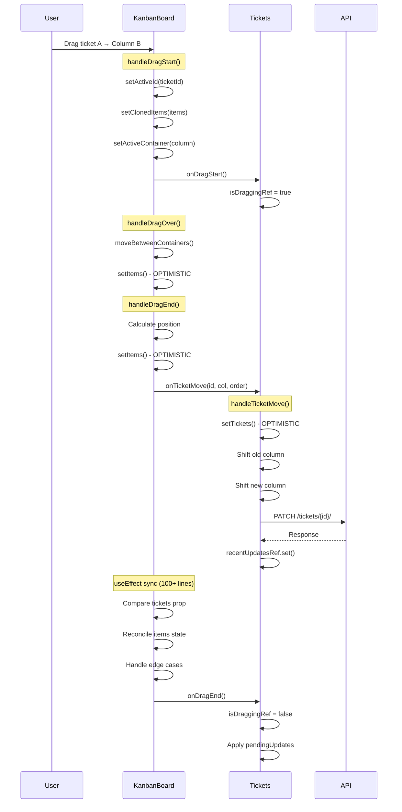
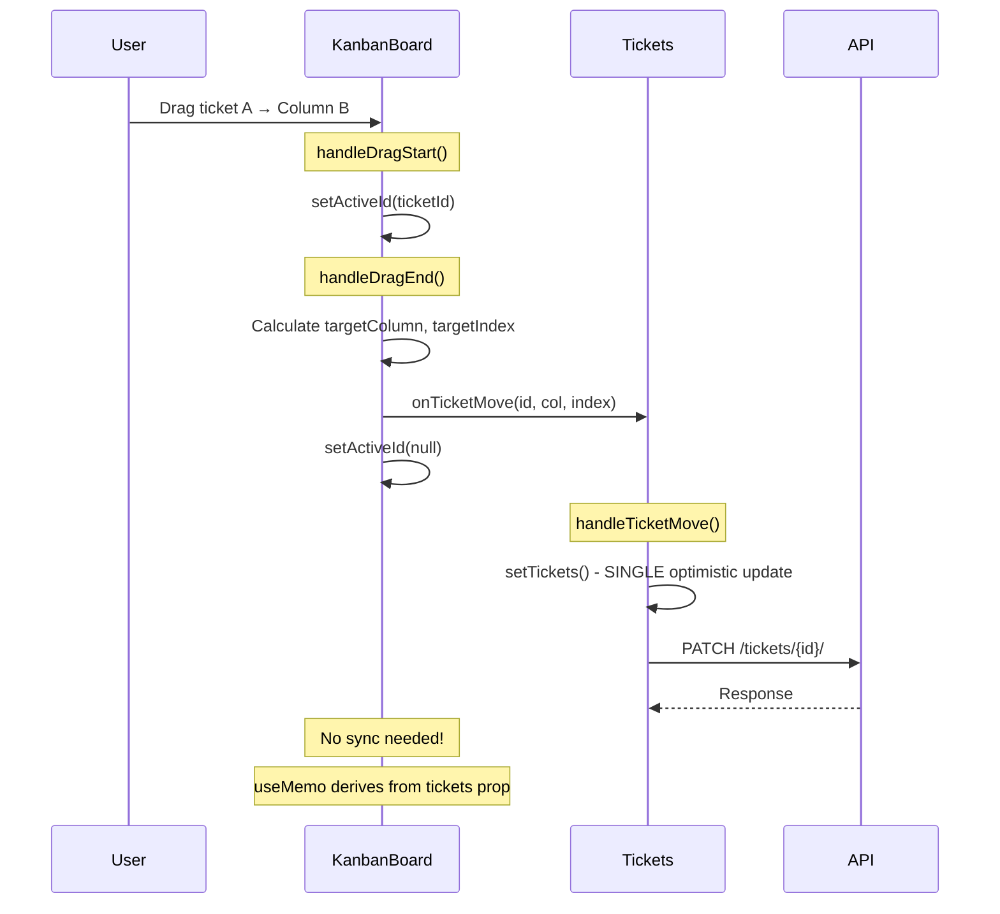

# Solution A: Simplified Single-State Kanban Implementation Plan

## Overview

Transform the Kanban system from a complex multi-state architecture to a simple, predictable single-state design.

**Core Principle**: The parent component (`Tickets.tsx`) owns ALL state. `KanbanBoard` is purely presentational.

**Approach**: Replace existing files in-place. No new files, no file bloat.

---

## Current vs Target Architecture

```
┌─────────────────────────────────────────────────────────────────────────────┐
│                            CURRENT (COMPLEX)                                 │
├─────────────────────────────────────────────────────────────────────────────┤
│                                                                              │
│  Tickets.tsx                          KanbanBoard.tsx                        │
│  ┌────────────────────┐               ┌────────────────────┐                │
│  │ tickets state      │──────────────▶│ data state         │                │
│  │ (source of truth)  │               │ items state        │                │
│  │                    │               │ containers state   │                │
│  │ handleTicketMove() │◀──────────────│ activeId state     │                │
│  │ handleTicketReorder│               │ activeContainer    │                │
│  │                    │               │ clonedItems state  │                │
│  │ WebSocket handlers │               │                    │                │
│  │ Optimistic updates │               │ 100+ line useEffect│                │
│  │ isDraggingRef      │               │ Sync logic         │                │
│  │ pendingUpdatesRef  │               │ Collision detection│                │
│  └────────────────────┘               └────────────────────┘                │
│                                                                              │
│  600 lines                            600 lines                              │
│  Problems: Dual state, complex sync, race conditions, unpredictable         │
└─────────────────────────────────────────────────────────────────────────────┘

┌─────────────────────────────────────────────────────────────────────────────┐
│                            TARGET (SIMPLE)                                   │
├─────────────────────────────────────────────────────────────────────────────┤
│                                                                              │
│  Tickets.tsx                          KanbanBoard.tsx                        │
│  ┌────────────────────┐               ┌────────────────────┐                │
│  │ tickets state      │──────────────▶│ NO internal state! │                │
│  │ (ONLY source)      │               │                    │                │
│  │                    │               │ Derives columns    │                │
│  │ handleTicketMove() │◀──────────────│ from tickets prop  │                │
│  │ (single handler)   │               │                    │                │
│  │                    │               │ activeId (drag UI) │                │
│  │ Simple WS handlers │               │ Simple collision   │                │
│  └────────────────────┘               └────────────────────┘                │
│                                                                              │
│  ~400 lines (simplified)              ~200 lines (was 600)                   │
│  Benefits: Single state, no sync, predictable, easy to debug                │
└─────────────────────────────────────────────────────────────────────────────┘
```

---

## Workflow Comparison

### Current Workflow (Cross-Column Move)



**Problems:**
- 3 separate optimistic updates
- Complex useEffect sync that can cause loops
- isDraggingRef/pendingUpdatesRef add complexity
- Race conditions between state layers

---

### New Workflow (Cross-Column Move)



**Benefits:**
- 1 optimistic update (in parent only)
- No useEffect sync needed
- No refs for drag state tracking
- Predictable data flow

---

## Files to Modify (In-Place Replacement)

| File | Current Lines | Target Lines | Action |
|------|---------------|--------------|--------|
| `components/KanbanBoard.tsx` | 600 | ~200 | **REPLACE** |
| `pages/Tickets.tsx` | 1044 | ~900 | **SIMPLIFY** |

No new files. No file bloat.

---

## Implementation Steps

### Step 1: Replace KanbanBoard.tsx

**Current state variables to REMOVE:**
```typescript
// DELETE these
const [data, setData] = useState<Ticket[] | null>(null);
const [items, setItems] = useState<KanbanItems>({});
const [containers, setContainers] = useState<string[]>([]);
const [clonedItems, setClonedItems] = useState<KanbanItems | null>(null);
const lastOverId = useRef<string | null>(null);
const recentlyMovedToNewContainer = useRef(false);
```

**Keep only:**
```typescript
// KEEP these (minimal drag UI state)
const [activeId, setActiveId] = useState<string | null>(null);
```

**DELETE the 100+ line useEffect sync logic** (lines 62-160 approximately)

**REPLACE with simple useMemo derivation:**
```typescript
const columnsWithTickets = useMemo(() => {
  const sorted = [...columns].sort((a, b) => a.order - b.order);
  return sorted.map(column => ({
    column,
    tickets: tickets
      .filter(t => t.column === column.id)
      .sort((a, b) => (a.column_order || 0) - (b.column_order || 0))
  }));
}, [tickets, columns]);
```

---

### Step 2: Simplify Props Interface

**Current (complex):**
```typescript
interface KanbanBoardProps {
  tickets: Ticket[];
  columns: TicketColumn[];
  onTicketClick?: (ticket: Ticket) => void;
  onTicketMove?: (ticketId: number, newColumnId: number, order: number) => void;
  onTicketReorder?: (updates: Array<{...}>) => void;  // REMOVE
  onTicketCreated?: (ticket: Ticket) => void;
  onDragStart?: () => void;   // REMOVE
  onDragEnd?: () => void;     // REMOVE
}
```

**New (simple):**
```typescript
interface KanbanBoardProps {
  tickets: Ticket[];
  columns: TicketColumn[];
  onTicketClick?: (ticket: Ticket) => void;
  onTicketMove: (ticketId: number, targetColumnId: number, targetIndex: number) => void;
  onTicketCreated?: (ticket: Ticket) => void;
}
```

---

### Step 3: Simplify Tickets.tsx

**REMOVE these refs:**
```typescript
// DELETE
const isDraggingRef = useRef(false);
const pendingUpdatesRef = useRef<Array<{type: string; data: any}>>([]);
```

**REMOVE these handlers:**
```typescript
// DELETE handleDragStart and handleDragEnd callbacks
const handleDragStart = useCallback(() => {...}, []);
const handleDragEnd = useCallback(() => {...}, []);
```

**MERGE handleTicketReorder into handleTicketMove:**
- Single handler for all position changes
- Simpler API call logic

**SIMPLIFY WebSocket handling:**
- Remove complex 5-second window logic
- Simple dedup based on recent updates

---

### Step 4: Update KanbanBoard Usage in Tickets.tsx

**Current:**
```tsx
<KanbanBoard
  tickets={filteredTickets}
  columns={kanbanColumns}
  onTicketClick={handleTicketClick}
  onTicketMove={handleTicketMove}
  onTicketReorder={handleTicketReorder}
  onDragStart={handleDragStart}
  onDragEnd={handleDragEnd}
  onTicketCreated={...}
/>
```

**New:**
```tsx
<KanbanBoard
  tickets={filteredTickets}
  columns={kanbanColumns}
  onTicketClick={handleTicketClick}
  onTicketMove={handleTicketMove}
  onTicketCreated={...}
/>
```

---

## Line-by-Line Reduction

### KanbanBoard.tsx

| Section | Current Lines | New Lines | Savings |
|---------|---------------|-----------|---------|
| Imports | 30 | 20 | -10 |
| Types | 15 | 10 | -5 |
| State declarations | 15 | 3 | -12 |
| useEffect sync | 100 | 0 | -100 |
| moveBetweenContainers | 40 | 0 | -40 |
| collisionDetectionStrategy | 50 | 0 | -50 |
| handleDragStart | 15 | 5 | -10 |
| handleDragOver | 25 | 0 | -25 |
| handleDragEnd | 80 | 30 | -50 |
| handleDragCancel | 10 | 3 | -7 |
| Render | 120 | 80 | -40 |
| **TOTAL** | **~600** | **~200** | **~400** |

### Tickets.tsx

| Section | Current Lines | New Lines | Savings |
|---------|---------------|-----------|---------|
| Drag refs | 10 | 0 | -10 |
| handleTicketMove | 70 | 50 | -20 |
| handleTicketReorder | 35 | 0 | -35 |
| handleDragStart/End | 30 | 0 | -30 |
| WebSocket handlers | 80 | 40 | -40 |
| KanbanBoard props | 10 | 6 | -4 |
| **TOTAL** | **~235** | **~96** | **~139** |

---

## Rollback Strategy

Since we're replacing in-place:

1. **Before starting**: Create git commit with current state
2. **If issues**: `git checkout HEAD~1 -- frontend/src/components/KanbanBoard.tsx frontend/src/pages/Tickets.tsx`
3. **No database changes**: Backend untouched, instant rollback

---

## Implementation Order

1. Replace KanbanBoard.tsx (complete rewrite)
2. Simplify Tickets.tsx handlers  
3. Test in browser
4. Fix any issues

No mock data, no feature flags - early dev, test in production.

---

## Expected Metrics After Implementation

| Metric | Before | After | Improvement |
|--------|--------|-------|-------------|
| KanbanBoard.tsx lines | 600 | 200 | -67% |
| State variables | 6 | 1 | -83% |
| useEffect hooks | 3 | 0 | -100% |
| Callbacks from parent | 4 | 1 | -75% |
| Sync edge cases | 7+ | 0 | -100% |

---

## Next Steps

Ready to start implementation - just say "go".
