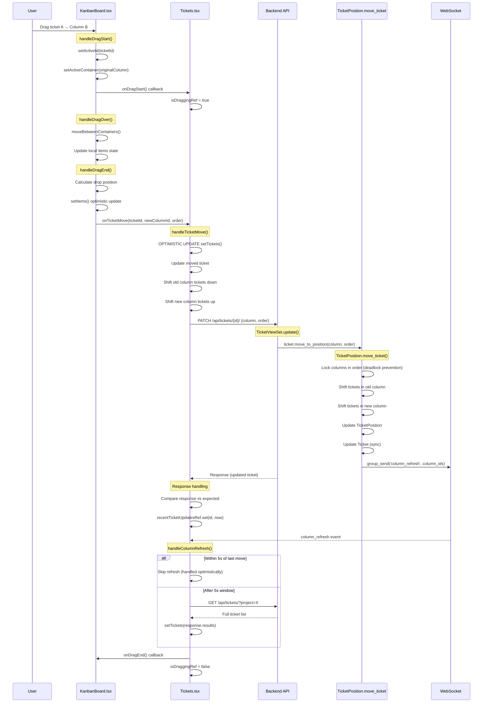
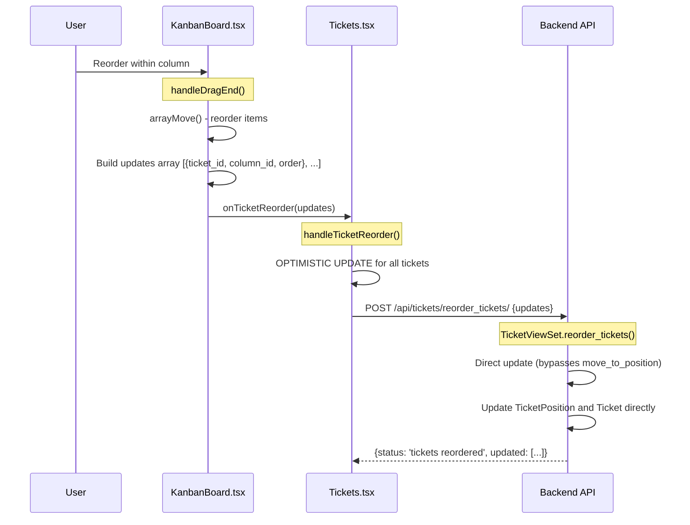
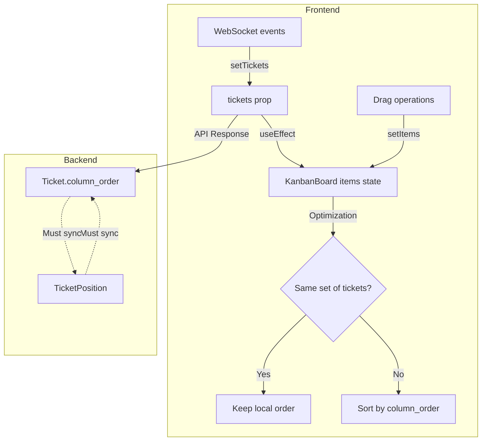
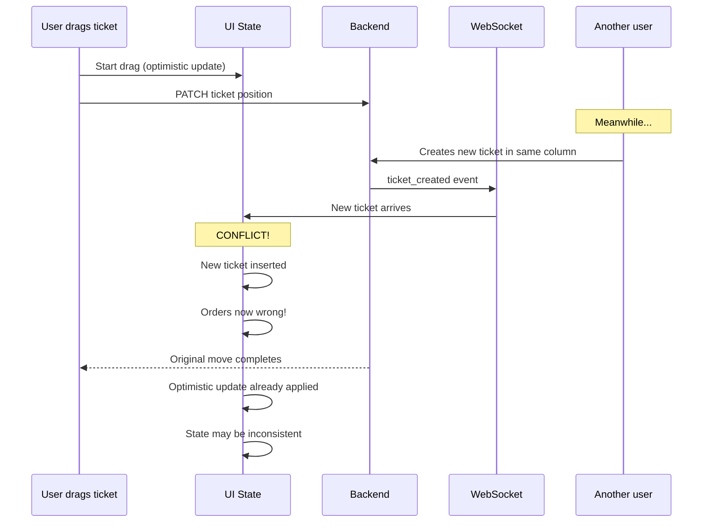
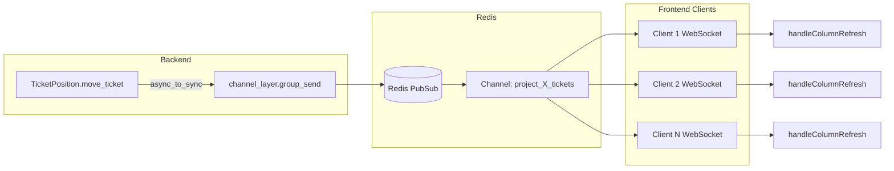
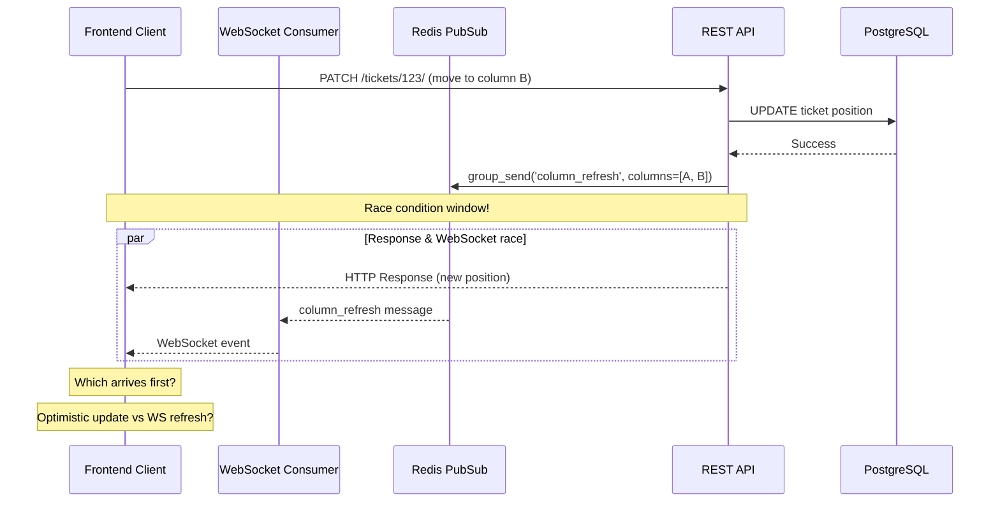
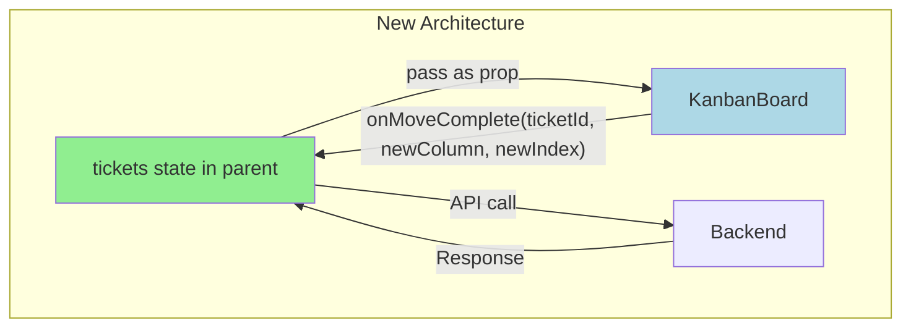

# Kanban System Complete Analysis

## Executive Summary

The Kanban system is **overengineered** with **multiple layers of complexity** that create race conditions, state desynchronization, and unreliable ticket movement. This document provides a complete examination of the current implementation and proposes solutions.

---

## Tech Stack

| Component | Technology | Role in Kanban |
|-----------|------------|----------------|
| Database | **PostgreSQL** | Stores tickets, positions, columns |
| Message Broker | **Redis** | WebSocket channel layer, Celery broker |
| Backend | Django + Channels | REST API + WebSocket connections |
| Frontend | React + @dnd-kit | Drag-drop UI |

---

## Table of Contents

1. [Current Architecture Overview](#current-architecture-overview)
2. [Data Flow Diagrams](#data-flow-diagrams)
3. [Problem Analysis](#problem-analysis)
4. [PostgreSQL-Specific Issues](#postgresql-specific-issues)
5. [Redis & WebSocket Issues](#redis--websocket-issues)
6. [Root Causes of Failures](#root-causes-of-failures)
7. [Proposed Solutions](#proposed-solutions)
8. [Implementation Roadmap](#implementation-roadmap)

---

## Current Architecture Overview

### Data Models

```
┌─────────────────────────────────────────────────────────────────────┐
│                         BACKEND MODELS                               │
├─────────────────────────────────────────────────────────────────────┤
│                                                                      │
│  ┌──────────────────────┐    ┌──────────────────────┐               │
│  │       Column         │    │   TicketPosition     │               │
│  ├──────────────────────┤    ├──────────────────────┤               │
│  │ id: PK               │    │ ticket: PK (FK)      │               │
│  │ name: str            │◄───│ column: FK           │               │
│  │ project: FK          │    │ order: int           │               │
│  │ order: int           │    │ updated_at: datetime │               │
│  │ color: str           │    └──────────────────────┘               │
│  └──────────────────────┘              ▲                            │
│                                        │ 1:1                        │
│  ┌──────────────────────────────────────┴───────────────────────┐   │
│  │                        Ticket                                 │   │
│  ├──────────────────────────────────────────────────────────────┤   │
│  │ id: PK                    column: FK (DUPLICATED!)            │   │
│  │ column_order: int (DUPLICATED!)                               │   │
│  │ name, description, priority, status, etc. (30+ fields)        │   │
│  └──────────────────────────────────────────────────────────────┘   │
└─────────────────────────────────────────────────────────────────────┘
```

### ⚠️ KEY PROBLEM: Dual Source of Truth

The position data exists in **TWO places**:
1. `Ticket.column` + `Ticket.column_order` (legacy)
2. `TicketPosition.column` + `TicketPosition.order` (new)

Both must be kept in sync, creating complexity and race conditions.

---

## Data Flow Diagrams

### Cross-Column Move (Current Implementation)



### Same-Column Reorder (Current Implementation)



### State Synchronization Flow



---

## Problem Analysis

### 1. State Synchronization Issues

```
┌────────────────────────────────────────────────────────────────────┐
│                    STATE LAYERS (TOO MANY!)                        │
├────────────────────────────────────────────────────────────────────┤
│                                                                    │
│  Layer 1: Tickets.tsx                                              │
│  ┌──────────────────────────────────────────────────────────────┐ │
│  │ const [tickets, setTickets] = useState<Ticket[]>()           │ │
│  │ • Source of truth for ticket DATA                            │ │
│  │ • Updated by API responses                                   │ │
│  │ • Updated by WebSocket events                                │ │
│  │ • Updated by optimistic updates                              │ │
│  └──────────────────────────────────────────────────────────────┘ │
│                           ↓ passed as prop                         │
│  Layer 2: KanbanBoard.tsx                                          │
│  ┌──────────────────────────────────────────────────────────────┐ │
│  │ const [items, setItems] = useState<KanbanItems>()            │ │
│  │ • Maps column IDs to ticket ID arrays                        │ │
│  │ • Controls VISUAL order during drag                          │ │
│  │ • Has complex sync logic with tickets prop                   │ │
│  └──────────────────────────────────────────────────────────────┘ │
│                                                                    │
│  Layer 3: dnd-kit internal state                                   │
│  ┌──────────────────────────────────────────────────────────────┐ │
│  │ Manages active drag, collision detection, transforms          │ │
│  └──────────────────────────────────────────────────────────────┘ │
│                                                                    │
└────────────────────────────────────────────────────────────────────┘
```

### 2. Race Condition Scenarios



### 3. Identified Failure Points

| # | Issue | Location | Impact |
|---|-------|----------|--------|
| 1 | Dual source of truth | `Ticket.column_order` + `TicketPosition.order` | Data desync |
| 2 | Complex sync useEffect | `KanbanBoard.tsx:62-160` | Infinite loops, UI jumps |
| 3 | Multiple optimistic updates | Both `Tickets.tsx` AND `KanbanBoard.tsx` update state | Double updates |
| 4 | WebSocket during drag | Events arrive while dragging | Position corruption |
| 5 | 5-second refresh window | `Tickets.tsx:306-308` | Arbitrary, may miss updates |
| 6 | No retry on failure | `handleTicketMove` | Silent failures |
| 7 | Order calculation bugs | Position calculation in `handleDragEnd` | Wrong positions |

---

## PostgreSQL-Specific Issues

### Current Database Schema

```sql
-- Ticket table (30+ columns, heavy locks)
CREATE TABLE tickets_ticket (
    id BIGSERIAL PRIMARY KEY,
    column_id INTEGER REFERENCES tickets_column(id),
    column_order INTEGER DEFAULT 0,  -- DUPLICATED position data
    name VARCHAR(255),
    description TEXT,
    -- ... 30+ more fields
);

-- TicketPosition table (lightweight, but DUPLICATES data)
CREATE TABLE tickets_ticketposition (
    ticket_id BIGINT PRIMARY KEY REFERENCES tickets_ticket(id),
    column_id INTEGER REFERENCES tickets_column(id),
    "order" INTEGER DEFAULT 0,
    updated_at TIMESTAMP
);
```

### PostgreSQL Locking Issues

```mermaid
sequenceDiagram
    participant TX1 as Transaction 1 (Move A)
    participant TX2 as Transaction 2 (Move B)
    participant PG as PostgreSQL

    TX1->>PG: BEGIN; SELECT ... FOR UPDATE (column 1 positions)
    TX2->>PG: BEGIN; SELECT ... FOR UPDATE (column 2 positions)
    
    TX1->>PG: SELECT ... FOR UPDATE (column 2 positions)
    Note over TX1,PG: BLOCKED! TX2 holds lock
    
    TX2->>PG: SELECT ... FOR UPDATE (column 1 positions)
    Note over TX2,PG: BLOCKED! TX1 holds lock
    
    Note over PG: DEADLOCK DETECTED!
    PG-->>TX2: ERROR: deadlock detected
    TX2->>TX2: Rollback, retry with exponential backoff
```

### Current Deadlock Prevention (Partially Working)

```python
# backend/tickets/models.py - TicketPosition.move_ticket()
# Lock columns in consistent order to prevent deadlocks
columns_to_lock = sorted(set([old_column_id, target_column_id]))

for column_id in columns_to_lock:
    list(cls.objects.select_for_update().filter(
        column_id=column_id
    ).order_by('ticket_id'))
```

**Problems with current approach:**
1. Locks entire columns, not just affected rows
2. Multiple UPDATE statements per move (shift operations)
3. `reorder_tickets` endpoint bypasses this logic entirely
4. No connection pooling optimization

### PostgreSQL Performance Bottlenecks

| Operation | Current SQL | Problem |
|-----------|-------------|---------|
| Cross-column move | 4-6 UPDATE statements | Too many round trips |
| Same-column shift | 2 UPDATE with `F('order') +/- 1` | Locks many rows |
| Batch reorder | N individual `update_or_create` | No bulk optimization |

**Improved approach with single UPDATE:**
```sql
-- Instead of shifting one by one, use a single UPDATE with CASE
UPDATE tickets_ticket 
SET column_order = CASE 
    WHEN id = $moved_ticket_id THEN $new_order
    WHEN column_order >= $new_order AND column_order < $old_order THEN column_order + 1
    WHEN column_order <= $new_order AND column_order > $old_order THEN column_order - 1
    ELSE column_order
END
WHERE column_id = $column_id;
```

---

## Redis & WebSocket Issues

### Current Redis Configuration

```python
# backend/config/settings.py
CHANNEL_LAYERS = {
    'default': {
        'BACKEND': 'channels_redis.core.RedisChannelLayer',
        'CONFIG': {
            "hosts": [REDIS_URL] if REDIS_URL else [(REDIS_HOST, REDIS_PORT)],
        },
    },
}

# Celery also uses Redis
CELERY_BROKER_URL = os.getenv('CELERY_BROKER_URL', _default_redis_url)
```

### WebSocket Message Flow



### Redis/WebSocket Race Conditions



### Current Mitigation (Flawed)

```typescript
// Tickets.tsx - 5-second window to ignore WebSocket
if (Date.now() - lastMoveTimeRef.current < 5000) {
    console.log("⏳ Skipping column refresh (handled optimistically)");
    return;
}
```

**Problems:**
1. Arbitrary 5-second window
2. May miss legitimate updates from other users
3. Doesn't account for network latency variation
4. No message sequencing or ordering

### Redis Pub/Sub Limitations

| Issue | Impact | Solution |
|-------|--------|----------|
| No message ordering | Events may arrive out of order | Add sequence numbers |
| Fire-and-forget | No delivery guarantee | Add acknowledgment |
| No message history | Missed if disconnected | Store in Redis sorted set |
| Single channel per project | All ticket events mixed | Use fine-grained channels |

### Proposed Redis Improvements

```python
# Add message sequencing
import time

async def broadcast_position_update(project_id, ticket_id, new_column, new_order):
    sequence = int(time.time() * 1000)  # Millisecond timestamp as sequence
    
    await channel_layer.group_send(
        f'project_{project_id}_tickets',
        {
            'type': 'position_update',
            'sequence': sequence,
            'ticket_id': ticket_id,
            'column_id': new_column,
            'order': new_order,
        }
    )
```

```typescript
// Frontend - ignore out-of-order messages
const lastSequenceRef = useRef<number>(0);

const handlePositionUpdate = (event: PositionUpdateEvent) => {
    if (event.sequence <= lastSequenceRef.current) {
        console.log('⏭️ Ignoring out-of-order message');
        return;
    }
    lastSequenceRef.current = event.sequence;
    // Apply update...
};
```

---

## Root Causes of Failures

### Root Cause 1: Over-Abstraction

The system tries to be too smart:
- Optimistic updates in parent (Tickets.tsx)
- Optimistic updates in child (KanbanBoard.tsx)
- Complex reconciliation logic
- Multiple update paths (PATCH vs reorder_tickets)

### Root Cause 2: Dual Source of Truth (Backend)

```python
# Both must stay in sync - any desync = bugs
class Ticket:
    column = FK(Column)
    column_order = IntegerField()

class TicketPosition:
    ticket = OneToOne(Ticket)
    column = FK(Column)
    order = IntegerField()
```

### Root Cause 3: Non-Atomic Updates

The frontend updates state in multiple steps:
1. KanbanBoard updates `items` (visual)
2. Parent callback updates `tickets` (data)
3. API returns, may trigger another update
4. WebSocket may arrive with different state

### Root Cause 4: Complex Collision Detection

```typescript
// KanbanBoard.tsx:237-290
const collisionDetectionStrategy = useCallback((args: any) => {
    // 50+ lines of complex collision logic
    // Multiple fallback strategies
    // Edge cases galore
}, [activeId, items]);
```

---

## Proposed Solutions

### Solution A: Simplified Single-State Architecture (RECOMMENDED)

**Principle**: One source of truth, minimal abstraction



**Key Changes**:

1. **Remove KanbanBoard internal items state**
   - Derive column groupings directly from tickets prop
   - No sync logic needed

2. **Single callback for all moves**
   ```typescript
   interface KanbanBoardProps {
     tickets: Ticket[];
     columns: Column[];
     onMoveComplete: (ticketId: number, newColumnId: number, newIndex: number) => Promise<void>;
   }
   ```

3. **Simplified DragEnd handler**
   ```typescript
   function handleDragEnd({ active, over }: DragEndEvent) {
     if (!over) return;
     
     const ticketId = extractTicketId(active.id);
     const newColumnId = extractColumnId(findContainer(over.id));
     const newIndex = calculateDropIndex(over);
     
     // Single callback - parent handles everything
     onMoveComplete(ticketId, newColumnId, newIndex);
   }
   ```

4. **Backend: Eliminate TicketPosition**
   - Keep only `Ticket.column` and `Ticket.column_order`
   - Simpler updates, no sync issues

### Solution B: LexoRank Positioning (For Scale)

If you need to support very high concurrency:

```typescript
// Instead of integer positions, use lexicographic strings
interface Ticket {
  id: number;
  column: number;
  rank: string; // "aaa", "aab", "aac" or "aaa|aab" (between aaa and aab)
}

// Insert between two tickets
function calculateRank(before: string | null, after: string | null): string {
  if (!before) return generateBefore(after);
  if (!after) return generateAfter(before);
  return midpoint(before, after);
}
```

**Benefits**:
- No need to shift other tickets on move
- Single row update
- No locking required
- Used by Jira, Trello, Linear

### Solution C: Incremental Improvements (Quick Wins)

If full rewrite isn't feasible:

1. **Remove dual optimistic updates**
   ```typescript
   // KanbanBoard.tsx - REMOVE all setItems calls during drag
   // Let parent handle ALL state updates
   ```

2. **Add debounced sync**
   ```typescript
   // Replace 5-second window with smart debounce
   const debouncedSync = useDebouncedCallback(
     () => refetchTickets(),
     1000,
     { leading: false, trailing: true }
   );
   ```

3. **Add retry logic**
   ```typescript
   const moveWithRetry = async (ticketId, columnId, order, retries = 3) => {
     for (let i = 0; i < retries; i++) {
       try {
         await ticketService.updateTicket(ticketId, { column: columnId, order });
         return;
       } catch (e) {
         if (i === retries - 1) throw e;
         await sleep(100 * (i + 1));
       }
     }
   };
   ```

4. **Remove TicketPosition model**
   ```python
   # Migration: Copy all positions to Ticket.column_order, delete TicketPosition
   # Simplifies backend significantly
   ```

### Solution D: PostgreSQL Optimizations

1. **Use bulk UPDATE with CASE statements**
   ```python
   from django.db import connection
   
   def bulk_reorder_tickets(ticket_orders: list[tuple[int, int]]):
       """
       ticket_orders: [(ticket_id, new_order), ...]
       """
       if not ticket_orders:
           return
       
       case_sql = " ".join([
           f"WHEN id = {tid} THEN {order}" 
           for tid, order in ticket_orders
       ])
       ids = ",".join(str(tid) for tid, _ in ticket_orders)
       
       with connection.cursor() as cursor:
           cursor.execute(f"""
               UPDATE tickets_ticket 
               SET column_order = CASE {case_sql} END
               WHERE id IN ({ids})
           """)
   ```

2. **Add PostgreSQL partial index for ordering**
   ```python
   class Meta:
       indexes = [
           models.Index(
               fields=['column', 'column_order'],
               name='ticket_column_order_idx'
           ),
       ]
   ```

3. **Use `select_for_update(skip_locked=True)` for non-blocking moves**
   ```python
   # Skip already-locked tickets instead of waiting
   tickets = Ticket.objects.select_for_update(skip_locked=True).filter(...)
   ```

4. **Add optimistic locking with version field**
   ```python
   class Ticket(models.Model):
       version = models.PositiveIntegerField(default=0)
       
       def save(self, *args, **kwargs):
           self.version += 1
           super().save(*args, **kwargs)
   ```

### Solution E: Redis WebSocket Improvements

1. **Add message sequencing to prevent race conditions**
   ```python
   import redis
   from django.conf import settings
   
   redis_client = redis.from_url(settings.REDIS_URL)
   
   def get_next_sequence(project_id: int) -> int:
       """Atomic sequence number from Redis"""
       key = f"project:{project_id}:seq"
       return redis_client.incr(key)
   
   async def broadcast_position_update(project_id, ticket_id, column_id, order):
       sequence = get_next_sequence(project_id)
       await channel_layer.group_send(
           f'project_{project_id}_tickets',
           {
               'type': 'position_update',
               'sequence': sequence,
               'ticket_id': ticket_id,
               'column_id': column_id,
               'order': order,
           }
       )
   ```

2. **Store recent positions in Redis for fast sync**
   ```python
   def cache_ticket_positions(project_id: int, positions: list):
       """Cache positions in Redis sorted set for fast retrieval"""
       key = f"project:{project_id}:positions"
       pipe = redis_client.pipeline()
       pipe.delete(key)
       for pos in positions:
           # Score = column_id * 10000 + order (for sorting)
           score = pos['column_id'] * 10000 + pos['order']
           pipe.zadd(key, {pos['ticket_id']: score})
       pipe.expire(key, 300)  # 5 min TTL
       pipe.execute()
   
   def get_cached_positions(project_id: int) -> list:
       """Get positions from Redis cache"""
       key = f"project:{project_id}:positions"
       return redis_client.zrange(key, 0, -1, withscores=True)
   ```

3. **Use Redis Streams for reliable message delivery** (Advanced)
   ```python
   # Instead of Pub/Sub, use Redis Streams for guaranteed delivery
   def publish_position_update(project_id, data):
       stream_key = f"stream:project:{project_id}:positions"
       redis_client.xadd(stream_key, data, maxlen=1000)  # Keep last 1000
   
   # Consumer can read from last known position
   def consume_updates(project_id, last_id='0'):
       stream_key = f"stream:project:{project_id}:positions"
       return redis_client.xread({stream_key: last_id}, block=5000)
   ```

---

## Implementation Roadmap

### Phase 1: Quick Wins (1-2 days)

```
□ Remove optimistic updates from KanbanBoard.tsx (let parent handle)
□ Add error handling with user feedback
□ Add retry logic for failed moves
□ Remove TicketPosition sync (backend simplification)
```

### Phase 2: PostgreSQL Optimization (1-2 days)

```
□ Add partial index on (column, column_order)
□ Replace multiple UPDATEs with single CASE statement
□ Add version field for optimistic locking
□ Use skip_locked=True for non-blocking operations
```

### Phase 3: Redis/WebSocket Fixes (1-2 days)

```
□ Add sequence numbers to WebSocket messages
□ Frontend: track last sequence, ignore out-of-order
□ Cache positions in Redis for fast sync after reconnect
□ Replace 5-second window with sequence-based dedup
```

### Phase 4: Architecture Cleanup (3-5 days)

```
□ Rewrite KanbanBoard to be stateless (derive from props)
□ Single onMoveComplete callback
□ Remove complex useEffect sync logic
□ Simplify collision detection
```

### Phase 5: Backend Simplification (2-3 days)

```
□ Remove TicketPosition model completely (migrate to Ticket.column_order)
□ Single UPDATE endpoint for position changes
□ Consider LexoRank for future scale
```

### Phase 6: Testing & Validation

```
□ Add E2E tests for drag-drop scenarios
□ Test concurrent user scenarios (multiple browser tabs)
□ Test network failure and reconnection scenarios
□ PostgreSQL deadlock stress tests
□ Redis failover testing
□ Performance benchmarks
```

---

## Appendix: Current Code Complexity Metrics

### Frontend

| File | Lines | Complexity Issue |
|------|-------|------------------|
| `KanbanBoard.tsx` | 600 | Complex useEffect (100+ lines), collision detection |
| `Tickets.tsx` | 1044 | Multiple update handlers, WebSocket logic |

### Backend

| File | Lines | Complexity Issue |
|------|-------|------------------|
| `models.py` TicketPosition.move_ticket | 180 | Dual model sync, deadlock prevention |
| `views.py` reorder_tickets | 100 | Bypasses move_ticket logic |

### Database/Infrastructure

| Component | Issue |
|-----------|-------|
| PostgreSQL | Multiple UPDATE per move, row-level locks on heavy Ticket table |
| Redis (Channels) | No message ordering, fire-and-forget Pub/Sub |
| Redis (Celery) | Separate from Channels, no position caching |

---

## Conclusion

The Kanban system fails because it's trying to be too clever:

**Frontend Issues:**
- Multiple state layers that must stay in sync
- Optimistic updates at multiple levels
- Complex reconciliation logic
- Race conditions between REST and WebSocket

**Backend Issues:**
- Dual models (`Ticket` + `TicketPosition`) that must stay in sync
- Multiple UPDATE statements per move operation
- Deadlock-prone locking strategy

**PostgreSQL Issues:**
- Heavy row locks on 30+ column Ticket table
- No optimistic locking (version field)
- Missing partial indexes for position queries

**Redis/WebSocket Issues:**
- No message sequencing (out-of-order delivery possible)
- Arbitrary 5-second window instead of proper deduplication
- No position caching for fast reconnection sync
- Fire-and-forget Pub/Sub without delivery guarantees

**Recommended Action Priority:**

1. **Immediate** (Day 1): Add sequence numbers to WebSocket messages, fix frontend dedup
2. **Short-term** (Week 1): Remove KanbanBoard internal state, single source of truth
3. **Medium-term** (Week 2): Remove TicketPosition model, optimize PostgreSQL queries
4. **Long-term**: Consider LexoRank for zero-shift positioning

The goal: **One source of truth, minimal abstraction, predictable data flow.**
