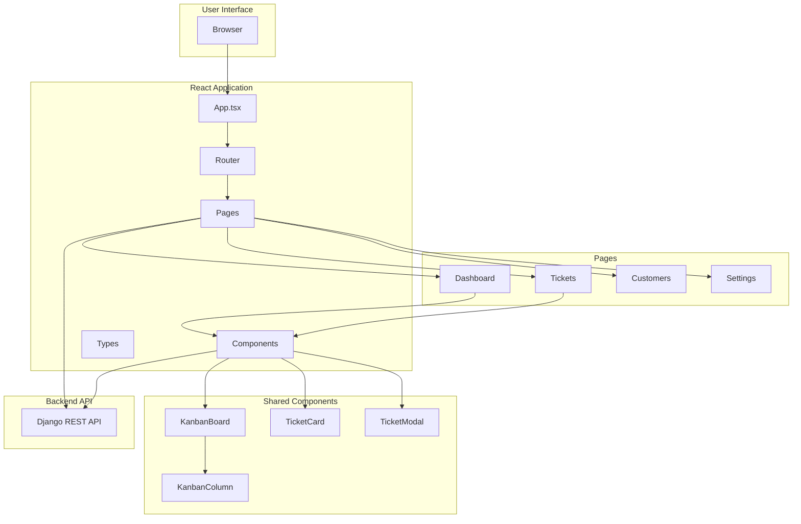
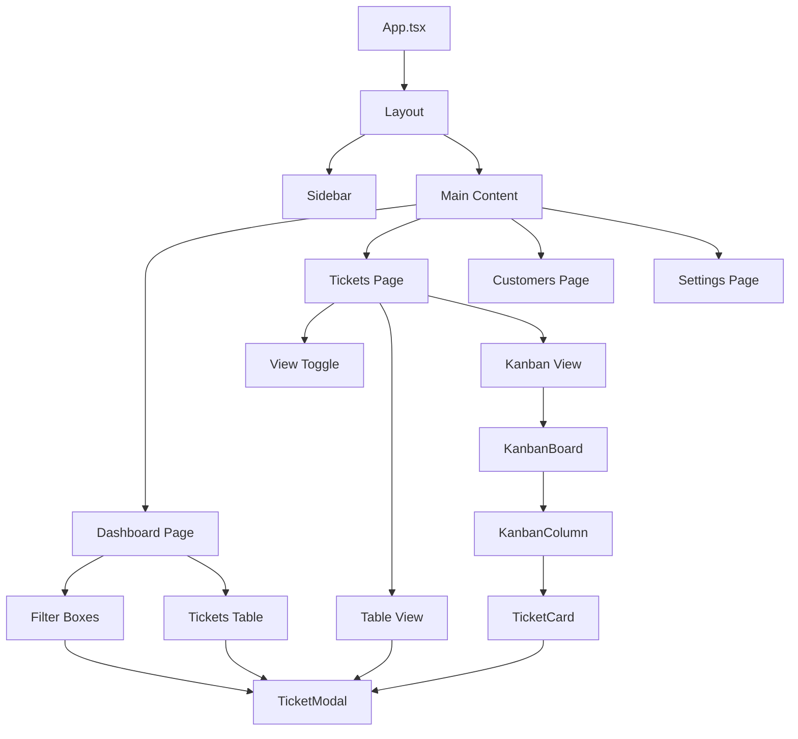
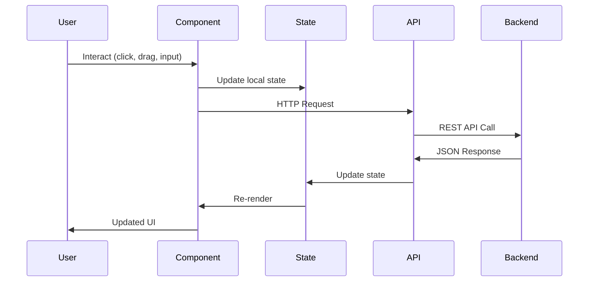

# Frontend Architecture Documentation

## Overview

The Ticketing System frontend is built with React 18, TypeScript, Vite, and Ant Design, following a component-based architecture with modern React patterns.

## Technology Stack

- **React 18.3**: UI library with hooks
- **TypeScript 5.6**: Type safety
- **Vite 7.1**: Build tool and dev server
- **Ant Design 5.x**: UI component library
- **React Router DOM v6**: Client-side routing
- **@dnd-kit**: Drag-and-drop functionality
- **Font Awesome**: Icon system
- **Node.js 22**: Runtime environment

---

## Application Architecture



---

## Project Structure

```
frontend/
├── public/              # Static assets
├── src/
│   ├── assets/         # Images, fonts, etc.
│   ├── components/     # Reusable components
│   │   ├── KanbanBoard.tsx
│   │   ├── KanbanColumn.tsx
│   │   ├── TicketCard.tsx
│   │   ├── TicketModal.tsx
│   │   └── PriorityIcons.tsx
│   ├── pages/          # Page components
│   │   ├── Dashboard.tsx
│   │   ├── Tickets.tsx
│   │   ├── Customers.tsx
│   │   └── Settings.tsx
│   ├── types/          # TypeScript types
│   │   └── ticket.ts
│   ├── App.tsx         # Root component
│   ├── App.css         # Global styles
│   ├── main.tsx        # Entry point
│   └── vite-env.d.ts   # Vite types
├── docs/               # Documentation
├── Dockerfile          # Docker configuration
├── nginx.conf          # Nginx configuration
├── package.json        # Dependencies
├── tsconfig.json       # TypeScript config
└── vite.config.ts      # Vite config
```

---

## Component Hierarchy



---

## Key Components

### App.tsx

Root component managing routing and layout.

**Features:**

- React Router setup
- Main layout structure
- Navigation sidebar
- Route configuration

---

### Dashboard Page

Main dashboard with quick filters and ticket overview.

**Features:**

- 5 draggable filter boxes (Unassigned, Assigned to Me, In Progress, New, Critical Priority)
- "All Tickets" table with search and pagination
- Filter boxes show first 3 tickets + count
- Drag-and-drop to reorder filters

**Dependencies:**

- `@dnd-kit/core`, `@dnd-kit/sortable`
- `TicketModal`
- Ant Design Table, Input

**State:**

```typescript
const [filterBoxes, setFilterBoxes] = useState<FilterBox[]>([...]);
const [searchText, setSearchText] = useState('');
const [selectedTicket, setSelectedTicket] = useState<Ticket | null>(null);
```

---

### Tickets Page

Ticket management with list and kanban views.

**Features:**

- Toggle between List and Kanban views
- Search and filter functionality
- Table view with Jira-style "Work" column
- Kanban board with drag-and-drop
- Click tickets to open modal

**Dependencies:**

- `KanbanBoard`
- `TicketModal`
- Ant Design Table, Space, Input, Select

**State:**

```typescript
const [viewMode, setViewMode] = useState<"list" | "kanban">("kanban");
const [searchText, setSearchText] = useState("");
const [filterStatus, setFilterStatus] = useState("");
const [selectedTicket, setSelectedTicket] = useState<Ticket | null>(null);
```

---

### KanbanBoard Component

Drag-and-drop kanban board.

**Props:**

```typescript
interface KanbanBoardProps {
  columns: TicketColumn[];
  onTicketClick?: (ticket: Ticket) => void;
}
```

**Features:**

- Horizontal column scrolling
- Drag tickets between columns
- Drag tickets within columns to reorder
- 8px activation constraint (prevents accidental drags)
- "Add column" button
- Click tickets to open modal

**Dependencies:**

- `@dnd-kit/core` (DndContext, PointerSensor, closestCenter)
- `@dnd-kit/sortable` (SortableContext, arrayMove)
- `KanbanColumn`
- `ClientOnlyPortal`

---

### KanbanColumn Component

Individual kanban column.

**Props:**

```typescript
interface KanbanColumnProps {
  column: TicketColumn;
  onTicketClick?: (ticket: Ticket) => void;
}
```

**Features:**

- Column header with ticket count
- Sortable ticket list
- "Add ticket" button after last ticket
- Passes click handler to TicketCard

**Dependencies:**

- `@dnd-kit/sortable` (useSortable, verticalListSortingStrategy)
- `TicketCard`

---

### TicketCard Component

Individual draggable ticket card.

**Props:**

```typescript
interface TicketCardProps {
  id: string;
  ticket: Ticket;
  disabled?: boolean;
  dragOverlay?: boolean;
  onClick?: (ticket: Ticket) => void;
}
```

**Features:**

- Issue type icon (task, bug, story, epic) with color
- Ticket ID format: `TYPE-ID` (e.g., BUG-1, TASK-5)
- Priority icon
- Assignee avatars (max 2 shown)
- Following indicator (eye icon)
- Comments count
- Click handler (disabled during drag)

**Dependencies:**

- `@dnd-kit/sortable` (useSortable)
- Font Awesome icons
- `PriorityIcons`
- Ant Design Avatar

---

### TicketModal Component

Comprehensive Jira-style ticket detail modal.

**Props:**

```typescript
interface TicketModalProps {
  open: boolean;
  onClose: () => void;
  ticket?: Ticket | null;
}
```

**Features:**

- **Header**: Add epic button, ticket type icon + ID, action buttons (view count, share, fullscreen, close)
- **Left Panel** (main content):
  - Editable title (24px font)
  - Description textarea
  - Subtasks section
  - Linked work items
  - Activity tabs (All/Comments/History/Work log)
  - Comment system with quick suggestions
  - "Pro tip: press M to comment"
- **Right Sidebar** (320px, details):
  - Status dropdown
  - Assignee selector + "Assign to me"
  - Labels
  - Parent ticket
  - Priority selector with icons
  - Due date picker
  - Customer field
  - Start date picker
  - Reporter (avatar + name)
  - Automation section
  - Timestamps (created/updated)
  - Configure link
- **Styling**:
  - Width: 1100px
  - Top: 20px
  - Scrollable body with custom scrollbar (8px, #dfe1e6)
  - Rounded corners
  - Minimalistic design

**Dependencies:**

- Ant Design Modal, Input, Select, DatePicker, Avatar, Button, Tabs
- Font Awesome icons
- `PriorityIcons`

---

## Type Definitions

### Ticket Type

```typescript
interface Ticket {
  id: number;
  colId: number;
  name: string;
  priorityId: number;
  following?: boolean;
  commentsCount?: number;
  assigneeIds?: number[];
  customer?: string;
  status?: string;
  createdAt?: string;
  urgency?: string;
  importance?: string;
  type?: "task" | "bug" | "story" | "epic";
}
```

### TicketColumn Type

```typescript
interface TicketColumn {
  id: number;
  name: string;
  items: Ticket[];
}
```

---

## Drag-and-Drop System

### @dnd-kit Configuration

**Sensors:**

```typescript
const sensors = useSensors(
  useSensor(PointerSensor, {
    activationConstraint: {
      distance: 8, // 8px drag before activation
    },
  })
);
```

**Benefits of 8px activation:**

- Prevents accidental drags when clicking
- Allows click events to work properly
- Smooth user experience

**Collision Detection:**

- `closestCenter`: Finds the closest droppable area

**Sorting Strategies:**

- `horizontalListSortingStrategy`: For filter boxes
- `verticalListSortingStrategy`: For kanban tickets

---

## Design System

### Colors (Jira-inspired)

```css
--text-primary: #172b4d;
--text-secondary: #5e6c84;
--background: #f4f5f7;
--link-color: #0052cc;
--border-color: #dfe1e6;
```

### Issue Type Colors

- **Task**: `#4bade8` (blue)
- **Bug**: `#e5493a` (red)
- **Story**: `#63ba3c` (green)
- **Epic**: `#904ee2` (purple)

### Border Radius

- Standard: `3px`
- Modal corners: `8px`

### Typography

- Title: 24px
- Body: 14px
- Small text: 12px

---

## State Management

Currently using React's built-in state management:

- `useState` for component state
- Props drilling for shared state
- Future: Consider Context API or Zustand for global state

---

## Data Flow



---

## Routing

**Routes:**

- `/` - Dashboard
- `/tickets` - Tickets (Kanban/List view)
- `/customers` - Customers (not implemented)
- `/settings` - Settings (not implemented)

**Router Configuration:**

```typescript
<BrowserRouter>
  <Routes>
    <Route path="/" element={<Layout />}>
      <Route index element={<Dashboard />} />
      <Route path="tickets" element={<Tickets />} />
      <Route path="customers" element={<Customers />} />
      <Route path="settings" element={<Settings />} />
    </Route>
  </Routes>
</BrowserRouter>
```

---

## Build & Deployment

### Development

```bash
npm run dev    # Start dev server on localhost:5173
```

### Production Build

```bash
npm run build  # Builds to /dist folder
```

### Docker Build

```bash
docker build -t ticketing-frontend .
docker run -p 8080:80 ticketing-frontend
```

**Docker features:**

- Multi-stage build
- Node 22 for build
- Nginx 1.26.2 for serving
- Gzip compression
- Client-side routing support
- Static asset caching (1 year)
- No cache for index.html
- Health check endpoint

---

## Performance Optimizations

1. **Code Splitting**: Vite automatically splits code by route
2. **Static Asset Caching**: 1-year cache for JS/CSS/images
3. **Gzip Compression**: Nginx compresses responses
4. **Lazy Loading**: Components loaded on demand
5. **Memoization**: Use `useMemo` and `useCallback` for expensive computations

---

## Accessibility

- Semantic HTML elements
- ARIA labels on interactive elements
- Keyboard navigation support
- Focus management in modals
- Color contrast ratios meet WCAG standards

---

## Browser Support

- Chrome/Edge: Latest 2 versions
- Firefox: Latest 2 versions
- Safari: Latest 2 versions
- No IE11 support (uses modern ES6+ features)

---

## Future Enhancements

- [ ] Authentication with JWT tokens
- [ ] Real-time updates with WebSockets
- [ ] Offline support with Service Workers
- [ ] Global state management (Context API or Zustand)
- [ ] Unit tests (Vitest)
- [ ] E2E tests (Playwright)
- [ ] Internationalization (i18n)
- [ ] Dark mode theme
- [ ] Mobile responsive improvements
